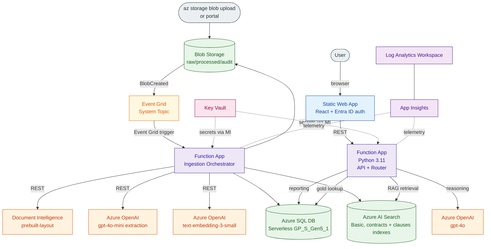
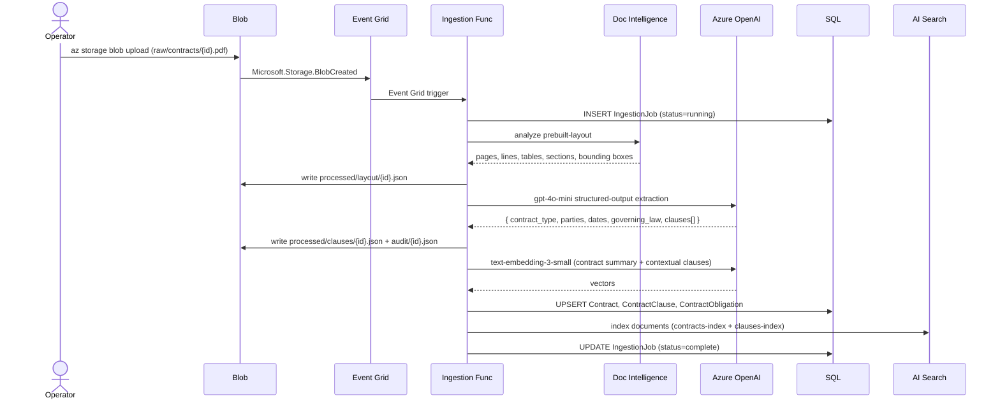

# POC Architecture

> The full diagram catalog (data flows, state lifecycles, UI flows, human-in-the-loop modes) lives in [`10-diagrams.md`](10-diagrams.md). This file shows the high-level component view + naming conventions.

## Component Diagram



## Component Table

| Component | Azure Resource | SKU | Purpose |
|---|---|---|---|
| Landing zone | Storage Account (StorageV2 + HNS) | Standard LRS, Hot | Raw + processed artifacts |
| Event bus | Event Grid System Topic | (consumption) | BlobCreated → Function fanout |
| Ingestion compute | Function App (Linux Consumption) | Y1 | Event-triggered orchestrator |
| API compute | Function App (Linux Consumption) | Y1 | HTTP API for web UI |
| OCR / layout | Document Intelligence | S0 | prebuilt-layout |
| LLM | Azure OpenAI account | S0 | gpt-4o-mini, gpt-4o, text-embedding-3-small deployments |
| Source of truth | Azure SQL Database | GP_S_Gen5_1 (Serverless, 1 vCore, 60min autopause) | Contract metadata |
| Retrieval | Azure AI Search | Basic, 1 replica / 1 partition, semantic ranker | contracts-index + clauses-index |
| UI host | Static Web App | Standard | React SPA + auth |
| Secrets | Key Vault | Standard, RBAC | Connection strings, OpenAI keys (overridden by MI where possible) |
| Observability | Application Insights + Log Analytics | PAYG | Logs, traces, metrics |
| Identity | System-assigned MI on Function Apps | — | Auth to Storage, SQL, OpenAI, DI, Search, KV |

## Sequence: Ingestion



## Sequence: Query (Router)

```mermaid
sequenceDiagram
    actor U as User
    participant UI as Static Web App
    participant API as API Function
    participant SQL
    participant AIS as AI Search
    participant AOAI as Azure OpenAI

    U->>UI: question
    UI->>API: POST /query
    API->>API: classify intent (rules first; gpt-4o-mini fallback)
    alt reporting
        API->>SQL: parameterized SELECT
        SQL-->>API: rows
        API-->>UI: table + optional NL phrasing via gpt-4o-mini
    else clause comparison
        API->>SQL: lookup contract + gold clause
        API->>AIS: retrieve clause-index match
        API->>AOAI: gpt-4o reasoning prompt with citations
        AOAI-->>API: grounded comparison
        API-->>UI: answer + side-by-side + citations
    else RAG
        API->>AIS: hybrid + semantic search
        AIS-->>API: top-k chunks/clauses
        API->>AOAI: gpt-4o answer prompt
        AOAI-->>API: grounded answer
        API-->>UI: answer + citations
    end
```

## Resource Naming

```
rg-contracts-poc-{env}                            # resource group
st{env}contracts{rand}                            # storage account (3-24 lc alphanum)
kv-contracts-{env}-{rand}                         # key vault
sql-contracts-{env}-{rand}                        # sql server
sqldb-contracts                                   # sql database
di-contracts-{env}-{rand}                         # document intelligence
oai-contracts-{env}-{rand}                        # openai
srch-contracts-{env}-{rand}                       # ai search
func-contracts-ingest-{env}-{rand}                # ingestion function app
func-contracts-api-{env}-{rand}                   # api function app
swa-contracts-{env}                               # static web app
appi-contracts-{env}                              # application insights
log-contracts-{env}                               # log analytics workspace
```

`{env}` ∈ {`dev`, `test`, `prod`}; `{rand}` is a 6-char `uniqueString()` suffix.
