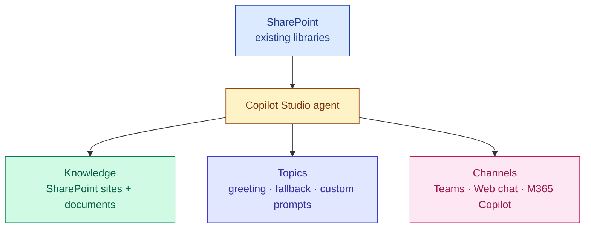
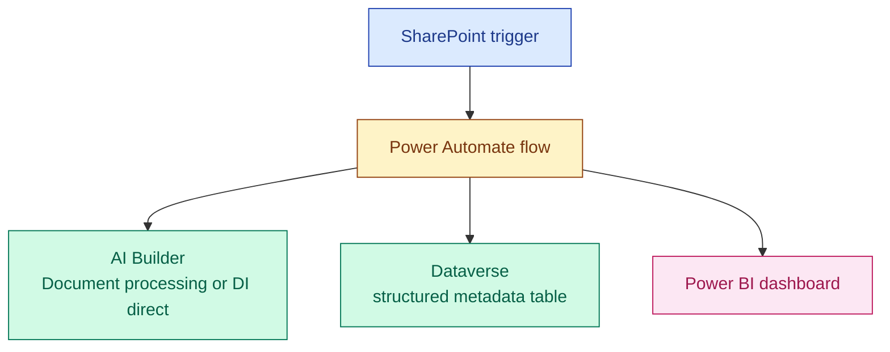

# Low-Code / No-Code Alternatives

A parallel low-code path could deliver a stakeholder-visible demo in ~2 days. We deliberately did not build it (decision in plan + ADR 0006), but we should know exactly what we're skipping and when to reconsider.

## Option A — Copilot Studio + SharePoint Knowledge Source



### What you get cheaply

- Teams publishing in one click
- M365 identity reused (no auth code)
- Ungrounded → grounded over SharePoint files (PDF, DOCX, PPTX, web pages)
- Guardrails, content moderation, basic analytics

### What you give up

| Limitation | Why it matters for legal-grade fidelity |
|---|---|
| Chunking is opaque | Citations land on chunks, not pages or clauses; harder to trace to source |
| No control over ranker | Can't tune for clause-level retrieval |
| Single retrieval index | No clauses-index alongside contracts-index |
| Limited router control | Can't deterministically force `expiring contracts` to a SQL path |
| No gold-clause comparison primitive | Would need an external Power Automate flow |
| Messaging-tier license cost | Per-message billing scales with usage |

### When this is actually the right choice

- Legal team needs a "ask SharePoint" demo *this week* and accuracy on metadata is not the deciding factor
- You haven't yet validated whether legal users will engage with an AI tool at all (cheaper than the pro-code investment to find out)
- The number of contracts is small (<200) and structure is consistent

### Cost (rough)

- Copilot Studio Tenant license: per-message tier (~10K messages/mo for ~$200)
- SharePoint already exists, no marginal cost
- No Azure infra to provision

---

## Option B — Power Automate + AI Builder + Document Intelligence + Dataverse



### What you get cheaply

- Designer-driven extraction flow
- Dataverse is a real relational store with row-level security
- Power BI for reporting
- Copilot Studio agent on top of Dataverse

### What you give up

| Limitation | Why it matters |
|---|---|
| Connector throughput limits | AI Builder document processing is plan-dependent; Premium connector quota tops out below 500 docs/day on standard plans |
| Dataverse storage cost | $40+/GB/mo for additional capacity; legal corpus inflates fast |
| No native clause comparison | Have to chain LLM calls via HTTP action — fragile |
| No native AI Search | Search degrades to Dataverse search (full-text only, no vectors) |
| Hard to source-control flow logic | Solution exports help but PR review is painful |

### When this is actually the right choice

- 500-document POC where the goal is *metadata extraction validation only* (no RAG, no clause comparison)
- Legal review workflow is the primary deliverable (Power Apps form on top of Dataverse is excellent for human-in-the-loop)
- Stakeholders are Power Platform fluent

---

## Hybrid — Pro-Code Pipeline + Copilot Studio Surface

A pragmatic future option: keep the pro-code Azure pipeline (this repo) as the source of truth, but expose results to Copilot Studio as **a custom plugin / connector** so business users can ask questions in Teams.

```
Azure pipeline (this repo) → AI Search + SQL
                                ↑
Copilot Studio agent ─ HTTP plugin ─┘
```

This is the path Microsoft has guided customers toward in 2025: pro-code where fidelity matters, Copilot Studio for distribution. Worth revisiting after POC.

---

## Verdict

For this POC, **document only**. The pro-code path is the one that stress-tests the architecture in [`../contract-architecture.md`](../contract-architecture.md). A Copilot Studio demo can be added later in 1–2 days using the same SharePoint corpus, after the pro-code pipeline has produced the answer fidelity that legal stakeholders are evaluating against.

### Re-evaluate Copilot Studio when

- Stakeholder demos need broader internal distribution before the web UI is polished
- M365 Copilot becomes an organizational standard and we want to integrate
- Legal team explicitly prefers Teams over a dedicated web app

### Re-evaluate Power Automate when

- Human review workflow becomes the priority deliverable
- The team building this shifts from engineering to business analysts
