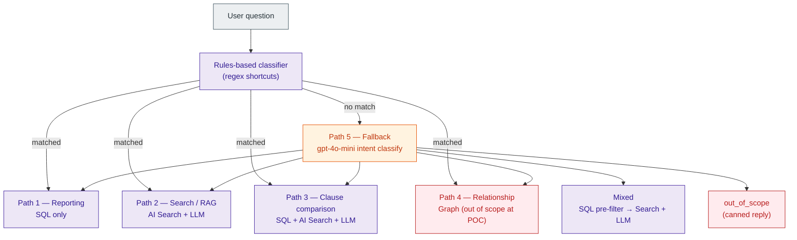

# Router Design

The router maps a user's question to one of five paths. **Deterministic first, LLM fallback only for ambiguity.**

## Five Paths



> Palette: standard set from [`10-diagrams.md` § Diagram conventions](10-diagrams.md#diagram-conventions). `compute` for handlers (rule-routed paths), `ai` for the LLM-fallback classifier, `oos` for the deferred relationship path + out_of_scope reply.

## Canonical Query Plan

Every question produces a query plan internally before any external call:

```json
{
  "intent": "reporting | search | clause_comparison | relationship | mixed | out_of_scope",
  "data_sources": ["sql", "ai_search", "graph", "gold_clauses"],
  "requires_llm": true,
  "requires_citations": true,
  "filters": { "contract_type": null, "counterparty": null, "expires_before": "2025-10-31" },
  "confidence": 0.92,
  "fallback_reason": null
}
```

The plan is logged in `audit/` alongside the answer for every query.

## Path 1 — Reporting (SQL only)

**Trigger phrases / regex** (deterministic):
- `^show me .* contracts? expiring`
- `^list .* contracts?`
- `^how many contracts?`
- `\\b(count|filter|by owner|by jurisdiction)\\b`
- date phrases: `next \\d+ (days|weeks|months)`, `before|after \\d{4}-\\d{2}-\\d{2}`

**Pipeline**:
```
question --> filter parser (regex + simple NLP)
          --> parameterized SQL via stored procedure
          --> rows
          --> optional NL phrasing (gpt-4o-mini, optional)
```

**Example queries**:
- "Show me contracts expiring in the next 6 months."
- "List all supplier agreements with auto-renewal."
- "How many contracts are missing governing law?"

LLM is **not** called to answer these.

## Path 2 — Search / RAG (AI Search + LLM)

**Trigger phrases**:
- `what does .* say about`
- `find contracts? mentioning`
- `search for`
- `summarize`
- "tell me about [topic]"

**Pipeline**:
```
question --> embedding (text-embedding-3-small)
          --> hybrid search (keyword + vector + semantic ranker) on contracts-index
          --> if top-k filtered to a single contract, also pull from clauses-index
          --> gpt-4o RAG answer prompt with retrieved chunks + citations
          --> answer with page-level citations
```

**Example queries**:
- "What does the Acme MSA say about audit rights?"
- "Find contracts that mention SOC 2 compliance."
- "Summarize the termination rights in this contract."

## Path 3 — Clause Comparison (SQL + AI Search + LLM)

**Trigger phrases**:
- `compare .* (to|with|against) (our|the|standard|gold)`
- `is .* (more|less) favorable than`
- `how does .* differ`
- `risk(y)? (clause|term)`

**Pipeline**:
```
question --> resolve contract from SQL (by name / counterparty match)
          --> resolve clause type from SQL.ContractClause
          --> resolve gold clause version applicable to contract jurisdiction + type
          --> deterministic diff (line-level)
          --> semantic similarity score
          --> gpt-4o legal-difference prompt (compare_clause.json)
          --> structured output: differences[], summary, overall_risk
```

**Example queries**:
- "Compare the indemnity clause in the Acme MSA to our standard."
- "How does the limitation of liability in [contract] differ from our gold standard?"
- "Is the termination clause in [contract] more or less favorable than our policy?"

## Path 4 — Relationship (Graph) — Out of Scope at POC

**Trigger phrases**:
- `subsidiar(y|ies)`
- `parent company`
- `under (the|our) master agreement`
- `amendments? (to|of)`
- `change of control`

**At POC**: Return `{"intent": "relationship", "out_of_scope": true, "explanation": "Relationship queries require a graph store, which is not part of the POC. Try rephrasing as a structured filter or content search."}`. ADR 0007.

## Path 5 — Fallback Intent Classification (gpt-4o-mini)

When deterministic rules don't match, call gpt-4o-mini with the prompt in [`03-models-and-prompts.md`](03-models-and-prompts.md). The LLM returns one of the four real intents (or `out_of_scope`). Confidence < 0.6 → return a clarifying question to the user.

## Mixed Intent

Some questions are honestly multi-path:

> "How many contracts with Acme are governed by New York law and have non-standard indemnity?"

Treated as `mixed`:
1. SQL filter for `counterparty = Acme AND governing_law = New York` → contract IDs
2. AI Search clause-index filter for `contract_id IN [...] AND clause_type = indemnity AND deviation_score > 0.3`
3. gpt-4o synthesizes the answer with citations

The classifier emits `mixed` and lists all three sources in `data_sources`.

## Non-Functional Properties

- **Determinism**: 70%+ of expected POC traffic resolves without LLM intent classification (rules cover the reporting queries).
- **Latency budget**:
  - reporting: <1.5s
  - search: <6s p95
  - clause comparison: <8s p95
  - mixed: <12s p95
- **Citation invariant**: Every LLM answer must include at least one citation. If retrieval returns nothing relevant, the API returns "I don't know" — not an LLM-generated guess.
- **No model memory**: System prompt forbids answering from training data; the LLM must answer only from retrieved evidence.

## Future Extensions

- Function calling / tool use to let the LLM choose paths within `mixed`
- Re-ranking with cross-encoder for higher search precision
- Semantic Kernel planner for multi-step research questions
