# Diagrams

Catalog of mermaid diagrams covering system architecture, data flows, state lifecycles, UI interactions, and human-in-the-loop modes. The diagrams in [`01-architecture.md`](01-architecture.md) are the high-level overview; this file is the comprehensive set used for design reviews and onboarding.

---

## Diagram conventions

To make diagrams across the doc set scannable, every flowchart should classify its nodes into the categories below. Pastel fills with darker stroke + matching text — readable in both light and dark mode.

| Category | Class | Used for |
|---|---|---|
| User / actor | `user` | The person initiating an action; entry-point actors |
| UI surface | `ui` | Web frontend (Static Web App, React tabs) |
| Compute / handler | `compute` | Function Apps, FastAPI server, watcher loops, route handlers |
| Eventing / async | `eventing` | Event Grid, queues, polling triggers |
| Data store | `data` | SQL DB, blob containers, vector indexes |
| AI service | `ai` | Document Intelligence, Azure OpenAI, Ollama, embeddings, LLM calls |
| Identity / secrets | `identity` | Entra ID, Managed Identity, Key Vault |
| Observability | `ops` | App Insights, Log Analytics, KQL dashboards |
| Out-of-scope / inactive | `oos` | Deferred capabilities, greyed-out paths |

**Copy-paste palette block** to drop at the bottom of any new flowchart:

```
classDef user      fill:#eceff1,stroke:#455a64,color:#263238;
classDef ui        fill:#e3f2fd,stroke:#0d47a1,color:#0d47a1;
classDef compute   fill:#ede7f6,stroke:#4527a0,color:#311b92;
classDef eventing  fill:#fff8e1,stroke:#ef6c00,color:#e65100;
classDef data      fill:#e8f5e9,stroke:#1b5e20,color:#1b5e20;
classDef ai        fill:#fff3e0,stroke:#e65100,color:#bf360c;
classDef identity  fill:#fce4ec,stroke:#880e4f,color:#880e4f;
classDef ops       fill:#f3e5f5,stroke:#4a148c,color:#4a148c;
classDef oos       fill:#ffebee,stroke:#b71c1c,color:#b71c1c;
```

Then assign with `class NodeId category;` (or comma-separated for multiple nodes). Section 1.1 below is the canonical example. Sequence diagrams don't get coloured per-participant (mermaid's sequence syntax doesn't support `classDef`); rely on participant ordering + emoji actor for actors.

---

## 1. System Architecture

### 1.1 Container view (C4-ish)

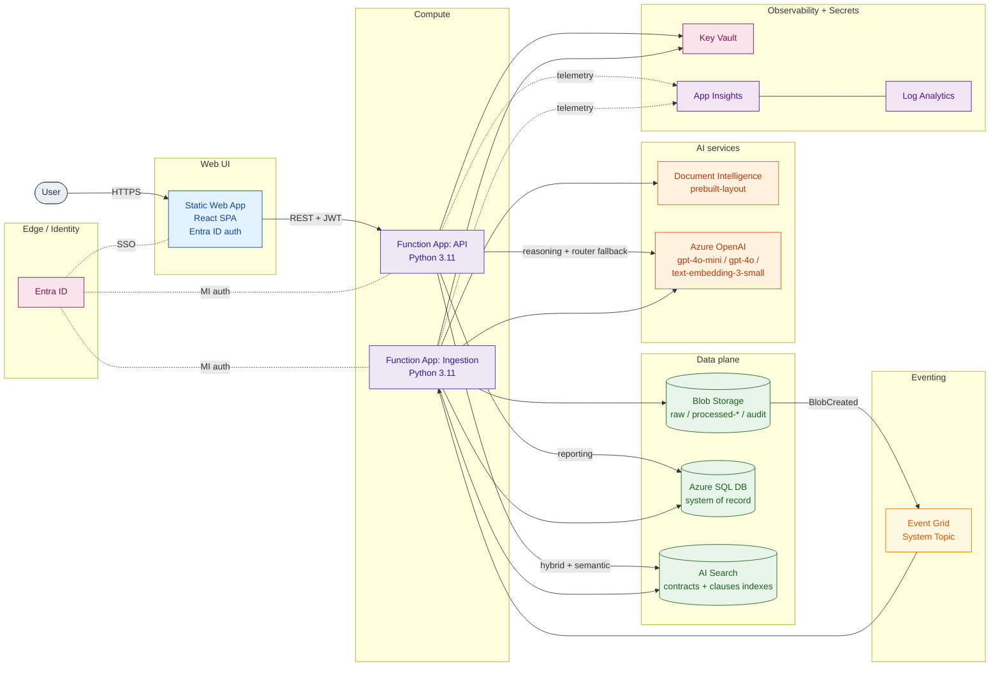
```mermaid
flowchart LR
  subgraph Edge[Edge / Identity]
    EID[Entra ID]
  end

  subgraph UI[Web UI]
    SWA["Static Web App<br/>React SPA<br/>Entra ID auth"]
  end

  subgraph Compute[Compute]
    FAPI["Function App: API<br/>Python 3.11"]
    FING["Function App: Ingestion<br/>Python 3.11"]
  end

  subgraph Eventing[Eventing]
    EG["Event Grid<br/>System Topic"]
  end

  subgraph Data[Data plane]
    BLOB[("Blob Storage<br/>raw / processed-* / audit")]
    SQL[("Azure SQL DB<br/>system of record")]
    AIS[("AI Search<br/>contracts + clauses indexes")]
  end

  subgraph AI[AI services]
    DI["Document Intelligence<br/>prebuilt-layout"]
    AOAI["Azure OpenAI<br/>gpt-4o-mini / gpt-4o /<br/>text-embedding-3-small"]
  end

  subgraph Ops[Observability + Secrets]
    KV[Key Vault]
    AINS[App Insights]
    LAW[Log Analytics]
  end

  USER([User])

  USER -->|HTTPS| SWA
  SWA -->|REST + JWT| FAPI
  FAPI -->|reporting| SQL
  FAPI -->|hybrid + semantic| AIS
  FAPI -->|reasoning + router fallback| AOAI
  FAPI --> KV
  FAPI -.telemetry.-> AINS

  BLOB -->|BlobCreated| EG --> FING
  FING --> DI
  FING --> AOAI
  FING --> BLOB
  FING --> SQL
  FING --> AIS
  FING --> KV
  FING -.telemetry.-> AINS

  AINS --- LAW
  EID -. SSO .- SWA
  EID -. MI auth .- FAPI
  EID -. MI auth .- FING

  classDef user      fill:#eceff1,stroke:#455a64,color:#263238;
  classDef ui        fill:#e3f2fd,stroke:#0d47a1,color:#0d47a1;
  classDef compute   fill:#ede7f6,stroke:#4527a0,color:#311b92;
  classDef eventing  fill:#fff8e1,stroke:#ef6c00,color:#e65100;
  classDef data      fill:#e8f5e9,stroke:#1b5e20,color:#1b5e20;
  classDef ai        fill:#fff3e0,stroke:#e65100,color:#bf360c;
  classDef identity  fill:#fce4ec,stroke:#880e4f,color:#880e4f;
  classDef ops       fill:#f3e5f5,stroke:#4a148c,color:#4a148c;
  class USER user;
  class SWA ui;
  class FAPI,FING compute;
  class EG eventing;
  class BLOB,SQL,AIS data;
  class DI,AOAI ai;
  class EID,KV identity;
  class AINS,LAW ops;
```

### 1.2 Network and identity boundaries

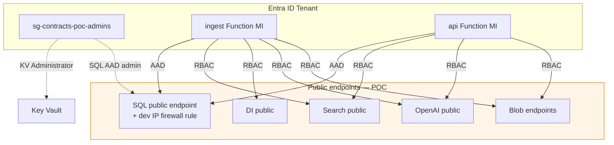
```mermaid
flowchart TB
  subgraph Public[Public endpoints — POC]
    direction LR
    Storage[Blob endpoints]
    SQLDB[SQL public endpoint<br/>+ dev IP firewall rule]
    OAI[OpenAI public]
    DocInt[DI public]
    SearchSvc[Search public]
  end

  subgraph Tenant[Entra ID Tenant]
    Group[sg-contracts-poc-admins]
    UMI1[ingest Function MI]
    UMI2[api Function MI]
  end

  Group -.->|SQL AAD admin| SQLDB
  Group -.->|KV Administrator| KV[Key Vault]
  UMI1 -- RBAC --> Storage
  UMI1 -- RBAC --> OAI
  UMI1 -- RBAC --> DocInt
  UMI1 -- RBAC --> SearchSvc
  UMI1 -- AAD --> SQLDB
  UMI2 -- RBAC --> Storage
  UMI2 -- RBAC --> OAI
  UMI2 -- RBAC --> SearchSvc
  UMI2 -- AAD --> SQLDB

  classDef prod fill:#fff5e6,stroke:#cc7a00
  Public:::prod
```

> **Production delta**: Public endpoints become Private Endpoints inside a VNet; Storage, SQL, OpenAI, DI, Search, KV all `publicNetworkAccess: Disabled`. Function Apps move to Premium with VNet integration.

### 1.3 Profile-aware factory branching

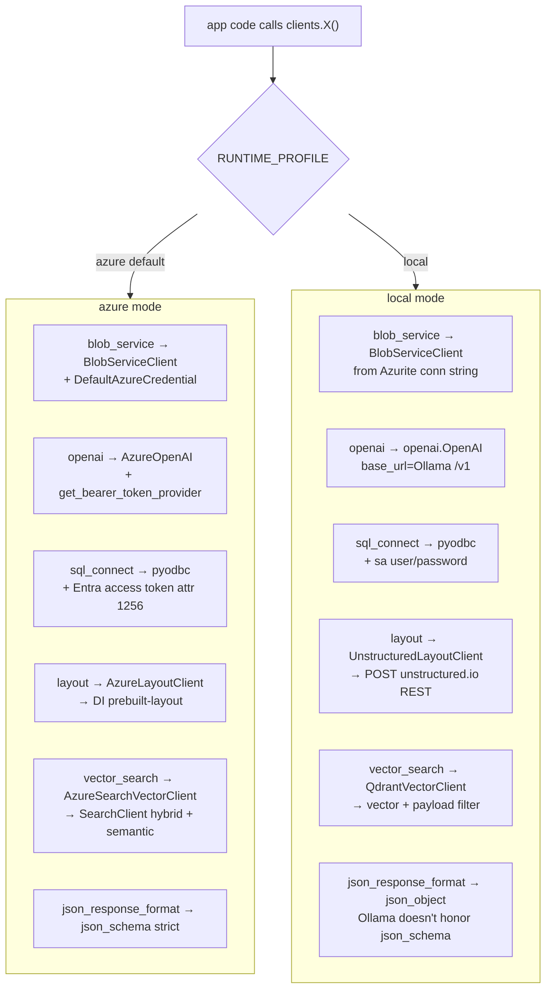
```mermaid
flowchart TD
  Code["app code calls clients.X()"] --> Profile{RUNTIME_PROFILE}
  Profile -- azure default --> AzureBranch
  Profile -- local --> LocalBranch

  subgraph AzureBranch[azure mode]
    A1[blob_service → BlobServiceClient<br/>+ DefaultAzureCredential]
    A2[openai → AzureOpenAI<br/>+ get_bearer_token_provider]
    A3[sql_connect → pyodbc<br/>+ Entra access token attr 1256]
    A4[layout → AzureLayoutClient<br/>→ DI prebuilt-layout]
    A5[vector_search → AzureSearchVectorClient<br/>→ SearchClient hybrid + semantic]
    A6[json_response_format → json_schema strict]
  end

  subgraph LocalBranch[local mode]
    L1[blob_service → BlobServiceClient<br/>from Azurite conn string]
    L2[openai → openai.OpenAI<br/>base_url=Ollama /v1]
    L3[sql_connect → pyodbc<br/>+ sa user/password]
    L4[layout → UnstructuredLayoutClient<br/>→ POST unstructured.io REST]
    L5[vector_search → QdrantVectorClient<br/>→ vector + payload filter]
    L6[json_response_format → json_object<br/>Ollama doesn't honor json_schema]
  end
```

> All Azure-SDK imports for credential / blob / search / DI are lazy inside the factories (see `src/shared/clients.py`). Local mode never installs azure-identity, azure-ai-documentintelligence, or azure-search-documents — see `src/local/requirements.txt`.

### 1.4 Local-runtime topology (docker-compose)

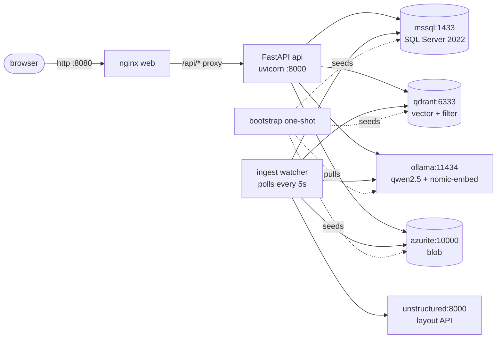
```mermaid
flowchart LR
  USER([browser]) -->|http :8080| WEB[nginx web]
  WEB -->|/api/* proxy| API[FastAPI api<br/>uvicorn :8000]

  API --> SQL[(mssql:1433<br/>SQL Server 2022)]
  API --> QDR[(qdrant:6333<br/>vector + filter)]
  API --> OLL[ollama:11434<br/>qwen2.5 + nomic-embed]
  API --> AZ[(azurite:10000<br/>blob)]

  WATCH[ingest watcher<br/>polls every 5s] --> AZ
  WATCH --> SQL
  WATCH --> QDR
  WATCH --> OLL
  WATCH --> UNS[unstructured:8000<br/>layout API]

  BOOT[bootstrap one-shot] -.seeds.-> SQL
  BOOT -.seeds.-> AZ
  BOOT -.seeds.-> QDR
  BOOT -.pulls.-> OLL
```

> Local mode replaces the Azure Functions runtime with a small FastAPI server (`src/local/api_server.py`) and a polling watcher (`src/local/ingest_watcher.py`). Same `shared.api.query()` and `pipeline.process_blob_event()` underneath.

### 1.5 Bicep deploy dependency order

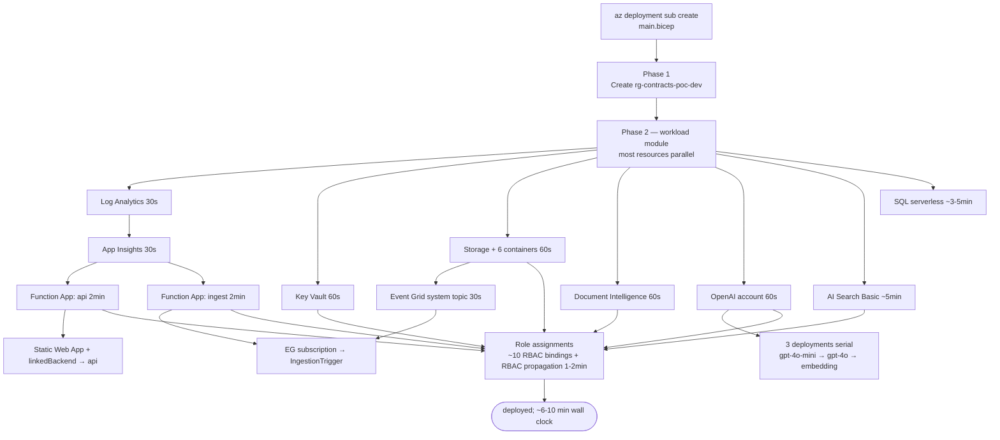
```mermaid
flowchart TD
  Sub[az deployment sub create<br/>main.bicep] --> RG[Phase 1<br/>Create rg-contracts-poc-dev]
  RG --> P2[Phase 2 — workload module<br/>most resources parallel]

  P2 --> LAW[Log Analytics 30s]
  P2 --> KV[Key Vault 60s]
  P2 --> ST[Storage + 6 containers 60s]
  P2 --> DI[Document Intelligence 60s]
  P2 --> OAI[OpenAI account 60s]
  P2 --> SEARCH[AI Search Basic ~5min]
  P2 --> SQL[SQL serverless ~3-5min]

  LAW --> AINS[App Insights 30s]
  OAI --> OAID[3 deployments serial<br/>gpt-4o-mini → gpt-4o → embedding]
  ST --> EG[Event Grid system topic 30s]

  AINS --> FAPI[Function App: api 2min]
  AINS --> FING[Function App: ingest 2min]

  FING --> EGSUB[EG subscription → IngestionTrigger]
  EG --> EGSUB

  FAPI --> SWA[Static Web App + linkedBackend → api]

  FAPI --> ROLES[Role assignments<br/>~10 RBAC bindings + RBAC propagation 1-2min]
  FING --> ROLES
  ST --> ROLES
  KV --> ROLES
  OAI --> ROLES
  DI --> ROLES
  SEARCH --> ROLES

  ROLES --> Done([deployed; ~6-10 min wall clock])
```

### 1.6 Role assignment matrix (Function App MIs → data plane)

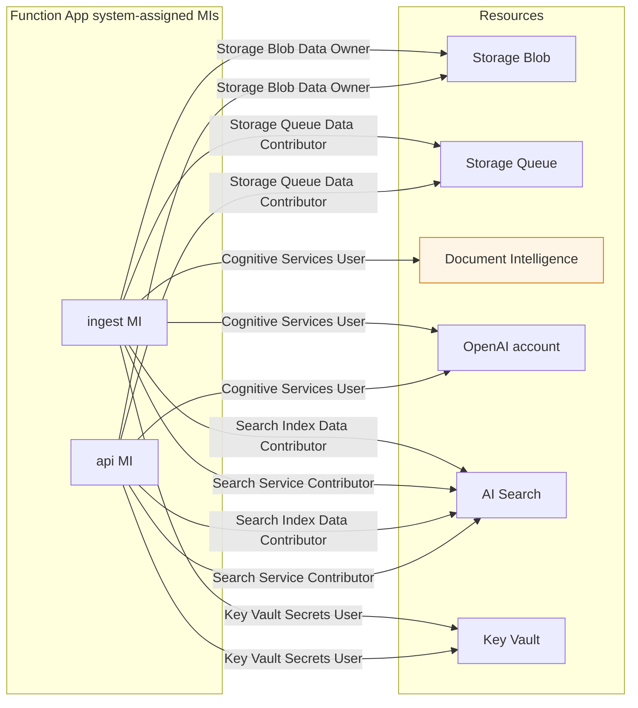
```mermaid
flowchart LR
  subgraph MIs[Function App system-assigned MIs]
    INGEST[ingest MI]
    API[api MI]
  end

  subgraph Resources
    BLOB[Storage Blob]
    Q[Storage Queue]
    DI[Document Intelligence]
    OAI[OpenAI account]
    SEARCH[AI Search]
    KV[Key Vault]
  end

  INGEST -- Storage Blob Data Owner --> BLOB
  INGEST -- Storage Queue Data Contributor --> Q
  INGEST -- Cognitive Services User --> DI
  INGEST -- Cognitive Services User --> OAI
  INGEST -- Search Index Data Contributor --> SEARCH
  INGEST -- Search Service Contributor --> SEARCH
  INGEST -- Key Vault Secrets User --> KV

  API -- Storage Blob Data Owner --> BLOB
  API -- Storage Queue Data Contributor --> Q
  API -- Cognitive Services User --> OAI
  API -- Search Index Data Contributor --> SEARCH
  API -- Search Service Contributor --> SEARCH
  API -- Key Vault Secrets User --> KV

  classDef ingestOnly fill:#fff5e6,stroke:#cc7a00
  DI:::ingestOnly
```

> SQL DB-level grants (`CREATE USER … FROM EXTERNAL PROVIDER`) are applied separately by `scripts/sql/001-schema.sql` after deploy — Bicep can't grant DB-level perms.

---

## 2. Ingestion Data Flow

### 2.1 Sequence — happy path

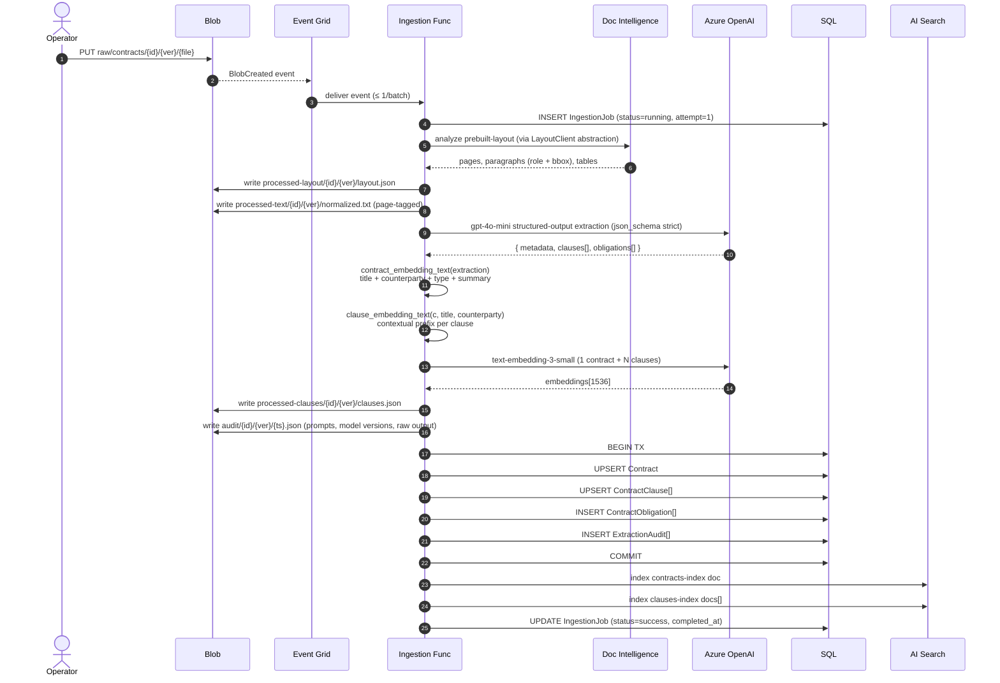
```mermaid
sequenceDiagram
  autonumber
  actor Op as Operator
  participant Blob
  participant EG as Event Grid
  participant Fn as Ingestion Func
  participant DI as Doc Intelligence
  participant AOAI as Azure OpenAI
  participant SQL
  participant AIS as AI Search

  Op->>Blob: PUT raw/contracts/{id}/{ver}/{file}
  Blob-->>EG: BlobCreated event
  EG->>Fn: deliver event (≤ 1/batch)
  Fn->>SQL: INSERT IngestionJob (status=running, attempt=1)
  Fn->>DI: analyze prebuilt-layout (via LayoutClient abstraction)
  DI-->>Fn: pages, paragraphs (role + bbox), tables
  Fn->>Blob: write processed-layout/{id}/{ver}/layout.json
  Fn->>Blob: write processed-text/{id}/{ver}/normalized.txt (page-tagged)
  Fn->>AOAI: gpt-4o-mini structured-output extraction (json_schema strict)
  AOAI-->>Fn: { metadata, clauses[], obligations[] }
  Fn->>Fn: contract_embedding_text(extraction)<br/>title + counterparty + type + summary
  Fn->>Fn: clause_embedding_text(c, title, counterparty)<br/>contextual prefix per clause
  Fn->>AOAI: text-embedding-3-small (1 contract + N clauses)
  AOAI-->>Fn: embeddings[1536]
  Fn->>Blob: write processed-clauses/{id}/{ver}/clauses.json
  Fn->>Blob: write audit/{id}/{ver}/{ts}.json (prompts, model versions, raw output)
  Fn->>SQL: BEGIN TX
  Fn->>SQL: UPSERT Contract
  Fn->>SQL: UPSERT ContractClause[]
  Fn->>SQL: INSERT ContractObligation[]
  Fn->>SQL: INSERT ExtractionAudit[]
  Fn->>SQL: COMMIT
  Fn->>AIS: index contracts-index doc
  Fn->>AIS: index clauses-index docs[]
  Fn->>SQL: UPDATE IngestionJob (status=success, completed_at)
```

### 2.2 Pipeline stages — retries and dead-letter

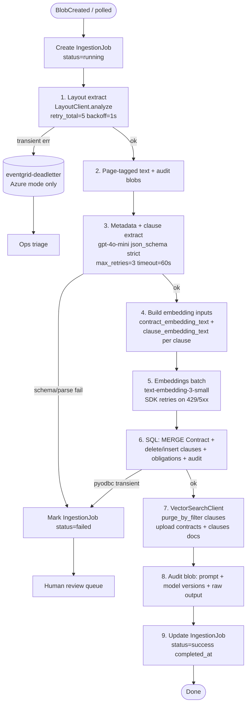
```mermaid
flowchart TD
  Start([BlobCreated / polled]) --> Job[Create IngestionJob<br/>status=running]
  Job --> S1[1. Layout extract<br/>LayoutClient.analyze<br/>retry_total=5 backoff=1s]
  S1 -- transient err --> DLQ[(eventgrid-deadletter<br/>Azure mode only)]
  S1 -- ok --> S2[2. Page-tagged text + audit blobs]
  S2 --> S3[3. Metadata + clause extract<br/>gpt-4o-mini json_schema strict<br/>max_retries=3 timeout=60s]
  S3 -- schema/parse fail --> Quar[Mark IngestionJob status=failed]
  S3 -- ok --> S4[4. Build embedding inputs<br/>contract_embedding_text +<br/>clause_embedding_text per clause]
  S4 --> S5[5. Embeddings batch<br/>text-embedding-3-small<br/>SDK retries on 429/5xx]
  S5 --> S6[6. SQL: MERGE Contract +<br/>delete/insert clauses + obligations + audit]
  S6 -- pyodbc transient --> Quar
  S6 -- ok --> S7[7. VectorSearchClient<br/>purge_by_filter clauses<br/>upload contracts + clauses docs]
  S7 --> S8[8. Audit blob: prompt + model versions + raw output]
  S8 --> S9[9. Update IngestionJob<br/>status=success completed_at]
  S9 --> Done([Done])
  Quar --> ReviewQueue[Human review queue]
  DLQ --> OpsTriage[Ops triage]
```

> Retries are SDK-level today: `AzureOpenAI(max_retries=3, timeout=60)` and `DocumentIntelligenceClient(retry_total=5, retry_backoff_factor=1.0)`. Pipeline-level retries are not implemented — the whole pipeline is the unit of replay (re-trigger by re-uploading the blob; idempotency keyed on `(FileHash, FileVersion)`). Service Bus + Durable Functions for per-stage retry is captured in ADR 0002 / 0003 as a production pull-forward.

### 2.3 Reprocessing

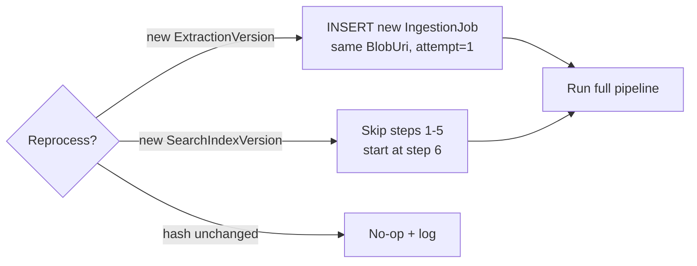
```mermaid
flowchart LR
  Trigger{"Reprocess?"} -->|new ExtractionVersion| ResetJob["INSERT new IngestionJob<br/>same BlobUri, attempt=1"]
  Trigger -->|new SearchIndexVersion| IndexOnly[Skip steps 1-5<br/>start at step 6]
  Trigger -->|hash unchanged| Skip[No-op + log]
  ResetJob --> Run[Run full pipeline]
  IndexOnly --> Run
```

### 2.4 Bootstrap container init (local stack)

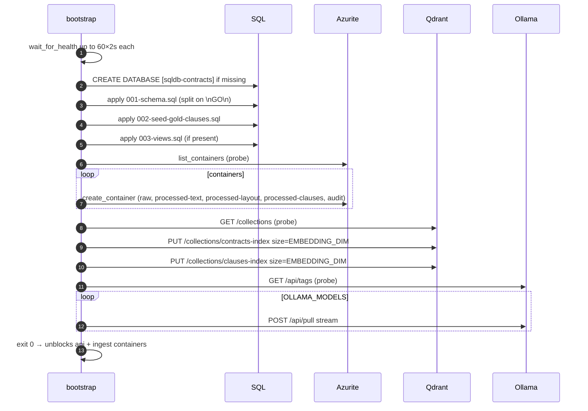
```mermaid
sequenceDiagram
  autonumber
  participant Boot as bootstrap
  participant SQL
  participant AZ as Azurite
  participant QDR as Qdrant
  participant OLL as Ollama

  Boot->>Boot: wait_for_health up to 60×2s each
  Boot->>SQL: CREATE DATABASE [sqldb-contracts] if missing
  Boot->>SQL: apply 001-schema.sql (split on \nGO\n)
  Boot->>SQL: apply 002-seed-gold-clauses.sql
  Boot->>SQL: apply 003-views.sql (if present)
  Boot->>AZ: list_containers (probe)
  loop containers
    Boot->>AZ: create_container (raw, processed-text, processed-layout, processed-clauses, audit)
  end
  Boot->>QDR: GET /collections (probe)
  Boot->>QDR: PUT /collections/contracts-index size=EMBEDDING_DIM
  Boot->>QDR: PUT /collections/clauses-index size=EMBEDDING_DIM
  Boot->>OLL: GET /api/tags (probe)
  loop OLLAMA_MODELS
    Boot->>OLL: POST /api/pull stream
  end
  Boot->>Boot: exit 0 → unblocks api + ingest containers
```

### 2.5 Embedding-text construction

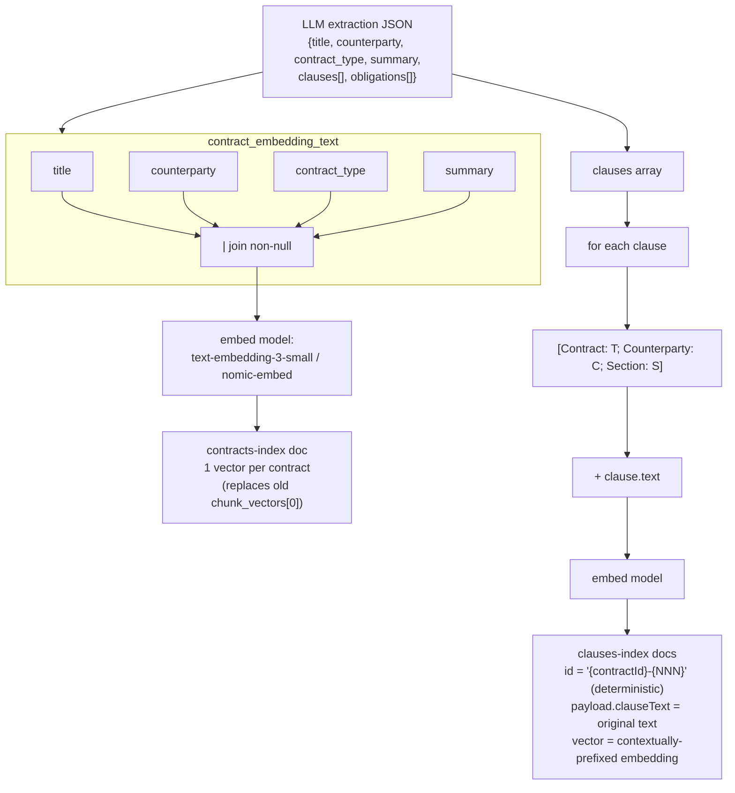
```mermaid
flowchart TD
  Extract["LLM extraction JSON<br/>{title, counterparty, contract_type, summary,<br/>clauses[], obligations[]}"] --> CT
  Extract --> Clauses[clauses array]

  subgraph CT[contract_embedding_text]
    direction LR
    F1[title] --> Pipe1["| join non-null"]
    F2[counterparty] --> Pipe1
    F3[contract_type] --> Pipe1
    F4[summary] --> Pipe1
  end
  Pipe1 --> EmbedC[embed model:<br/>text-embedding-3-small / nomic-embed]
  EmbedC --> ContractDoc["contracts-index doc<br/>1 vector per contract<br/>(replaces old chunk_vectors[0])"]

  Clauses --> ForEach[for each clause]
  ForEach --> CtxPrefix["[Contract: T; Counterparty: C; Section: S]"]
  CtxPrefix --> Body["+ clause.text"]
  Body --> EmbedCl[embed model]
  EmbedCl --> ClauseDocs["clauses-index docs<br/>id = '{contractId}-{NNN}' (deterministic)<br/>payload.clauseText = original text<br/>vector = contextually-prefixed embedding"]
```

> Stored `clauseText` is the original text; only the embedding *input* gets the contextual prefix. This is Anthropic's contextual-retrieval pattern (Sept 2024) — improves recall when the same clause type appears across many contracts.

---

## 3. Router Data Flow

### 3.1 Intent classifier (rules-as-cache, SLM-as-truth)

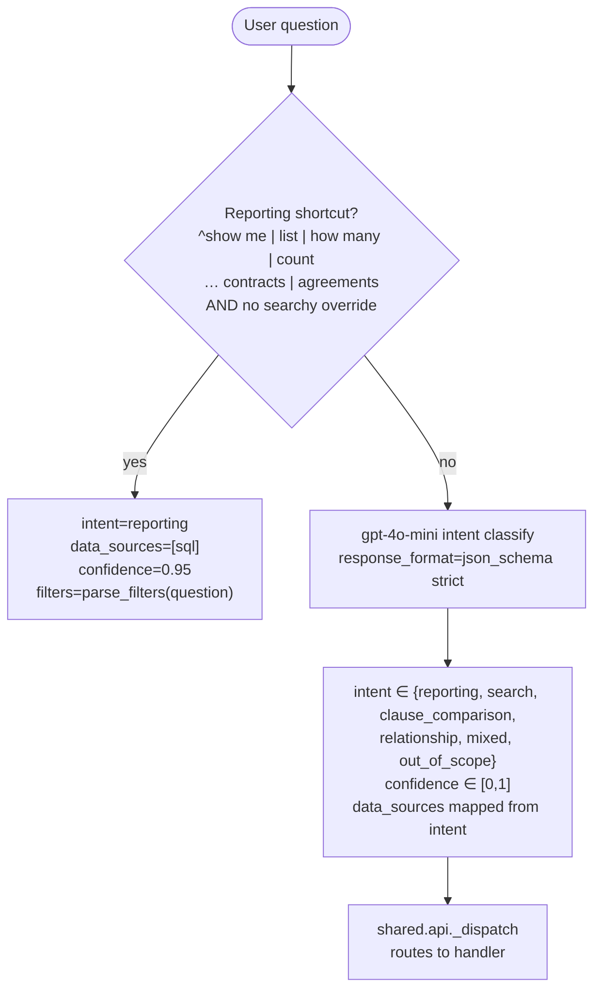
```mermaid
flowchart TD
  Q([User question]) --> Short{"Reporting shortcut?<br/>^show me | list | how many | count<br/>… contracts | agreements<br/>AND no searchy override"}
  Short -- yes --> ShortOut["intent=reporting<br/>data_sources=[sql]<br/>confidence=0.95<br/>filters=parse_filters(question)"]
  Short -- no --> LLM["gpt-4o-mini intent classify<br/>response_format=json_schema strict"]
  LLM --> Set["intent ∈ {reporting, search, clause_comparison,<br/>relationship, mixed, out_of_scope}<br/>confidence ∈ [0,1]<br/>data_sources mapped from intent"]
  Set --> Dispatch["shared.api._dispatch<br/>routes to handler"]
```

> Trimmed from the original 5-branch regex tree. Why: paraphrase brittleness + maintenance debt. The shortcut catches the canonical "show me / list / how many / count … contracts" reporting questions (~30% of POC traffic) deterministically; everything else costs ~$0.0001 + ~150ms for the SLM call. Searchy override (`say about|mentioning|summarize|tell me about|risky clause|compare|differs from|favorable than`) prevents the shortcut from claiming search/comparison/relationship questions even when "contracts" appears.

### 3.2 Path A — reporting (SQL only)

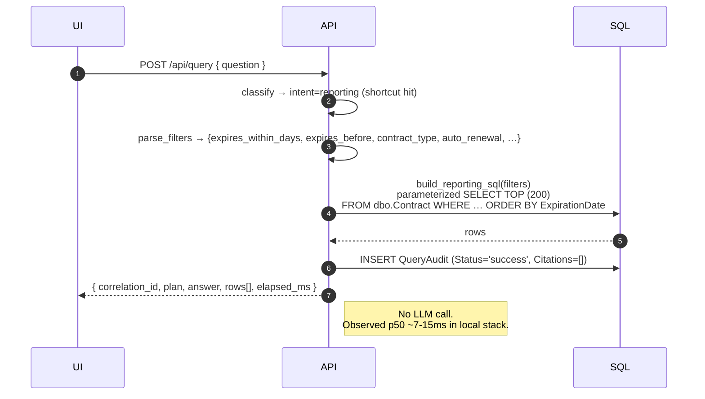
```mermaid
sequenceDiagram
  autonumber
  participant UI
  participant API
  participant SQL
  UI->>API: POST /api/query { question }
  API->>API: classify → intent=reporting (shortcut hit)
  API->>API: parse_filters → {expires_within_days, expires_before, contract_type, auto_renewal, …}
  API->>SQL: build_reporting_sql(filters)<br/>parameterized SELECT TOP (200)<br/>FROM dbo.Contract WHERE … ORDER BY ExpirationDate
  SQL-->>API: rows
  API->>SQL: INSERT QueryAudit (Status='success', Citations=[])
  API-->>UI: { correlation_id, plan, answer, rows[], elapsed_ms }
  Note right of API: No LLM call.<br/>Observed p50 ~7-15ms in local stack.
```

### 3.3 Path B — search / RAG (AI Search + LLM)

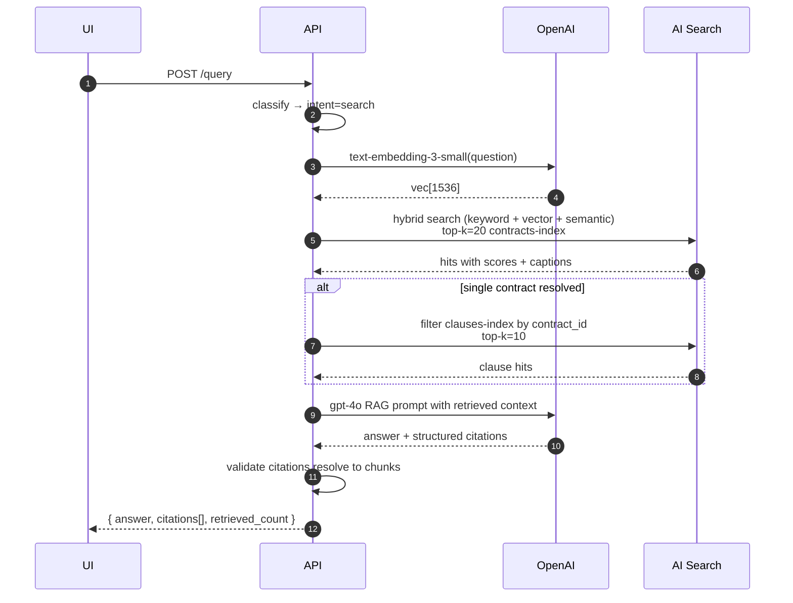
```mermaid
sequenceDiagram
  autonumber
  participant UI
  participant API
  participant AOAI as OpenAI
  participant AIS as AI Search
  UI->>API: POST /query
  API->>API: classify → intent=search
  API->>AOAI: text-embedding-3-small(question)
  AOAI-->>API: vec[1536]
  API->>AIS: hybrid search (keyword + vector + semantic)<br/>top-k=20 contracts-index
  AIS-->>API: hits with scores + captions
  alt single contract resolved
    API->>AIS: filter clauses-index by contract_id<br/>top-k=10
    AIS-->>API: clause hits
  end
  API->>AOAI: gpt-4o RAG prompt with retrieved context
  AOAI-->>API: answer + structured citations
  API->>API: validate citations resolve to chunks
  API-->>UI: { answer, citations[], retrieved_count }
```

### 3.4 Path C — clause comparison

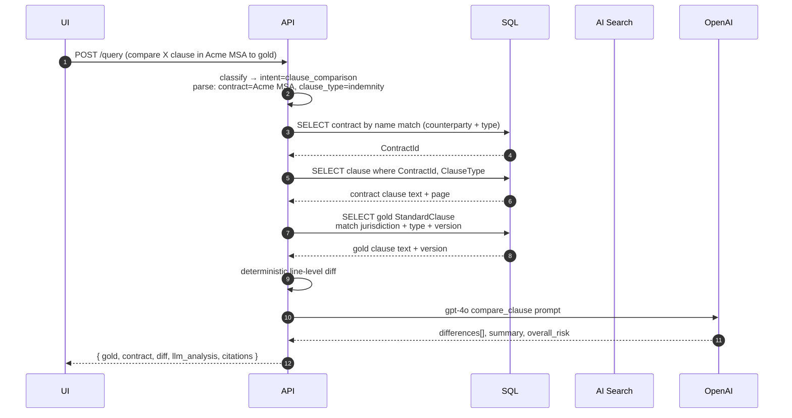
```mermaid
sequenceDiagram
  autonumber
  participant UI
  participant API
  participant SQL
  participant AIS as AI Search
  participant AOAI as OpenAI
  UI->>API: POST /query (compare X clause in Acme MSA to gold)
  API->>API: classify → intent=clause_comparison<br/>parse: contract=Acme MSA, clause_type=indemnity
  API->>SQL: SELECT contract by name match (counterparty + type)
  SQL-->>API: ContractId
  API->>SQL: SELECT clause where ContractId, ClauseType
  SQL-->>API: contract clause text + page
  API->>SQL: SELECT gold StandardClause<br/>match jurisdiction + type + version
  SQL-->>API: gold clause text + version
  API->>API: deterministic line-level diff
  API->>AOAI: gpt-4o compare_clause prompt
  AOAI-->>API: differences[], summary, overall_risk
  API-->>UI: { gold, contract, diff, llm_analysis, citations }
```

### 3.5 Path D — mixed (SQL + Search + LLM)

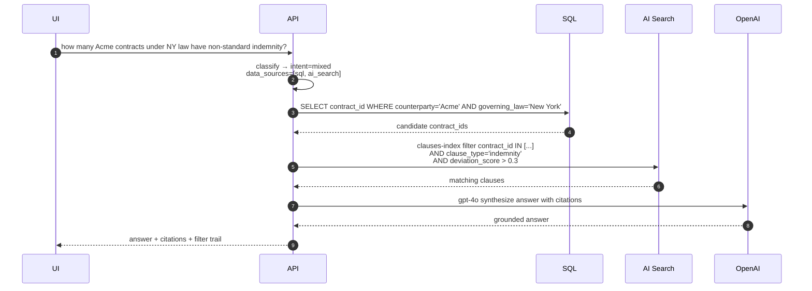
```mermaid
sequenceDiagram
  autonumber
  participant UI
  participant API
  participant SQL
  participant AIS as AI Search
  participant AOAI as OpenAI
  UI->>API: how many Acme contracts under NY law have non-standard indemnity?
  API->>API: classify → intent=mixed<br/>data_sources=[sql, ai_search]
  API->>SQL: SELECT contract_id WHERE counterparty='Acme' AND governing_law='New York'
  SQL-->>API: candidate contract_ids
  API->>AIS: clauses-index filter contract_id IN [...]<br/>AND clause_type='indemnity'<br/>AND deviation_score > 0.3
  AIS-->>API: matching clauses
  API->>AOAI: gpt-4o synthesize answer with citations
  AOAI-->>API: grounded answer
  API-->>UI: answer + citations + filter trail
```

### 3.6 Path E — relationship (out of scope at POC)

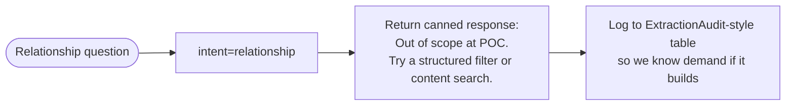
```mermaid
flowchart LR
  Q([Relationship question]) --> Detect[intent=relationship]
  Detect --> Polite["Return canned response:<br/>Out of scope at POC.<br/>Try a structured filter or content search."]
  Polite --> Log["Log to ExtractionAudit-style table<br/>so we know demand if it builds"]
```

---

## 4. State Lifecycles

### 4.1 Contract state

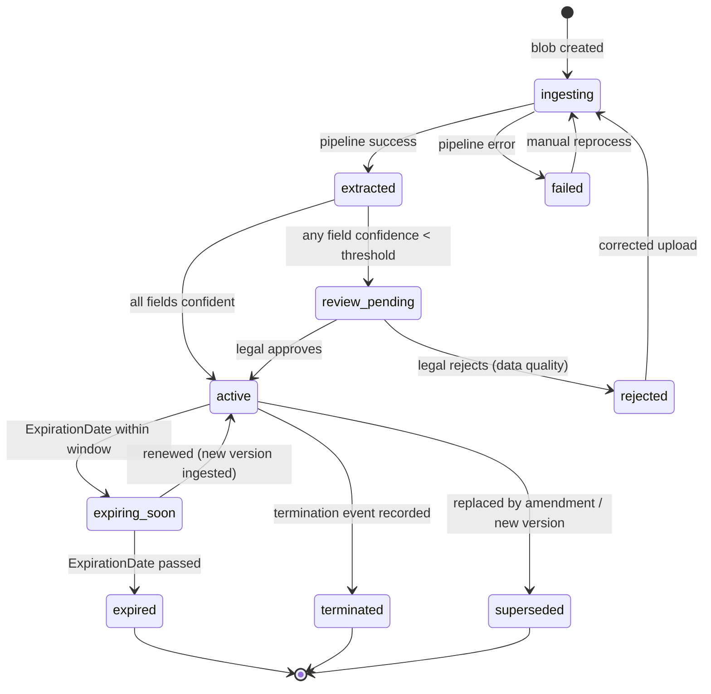
```mermaid
stateDiagram-v2
  [*] --> ingesting: blob created
  ingesting --> extracted: pipeline success
  ingesting --> failed: pipeline error
  failed --> ingesting: manual reprocess
  extracted --> review_pending: any field confidence < threshold
  extracted --> active: all fields confident
  review_pending --> active: legal approves
  review_pending --> rejected: legal rejects (data quality)
  rejected --> ingesting: corrected upload
  active --> expiring_soon: ExpirationDate within window
  expiring_soon --> active: renewed (new version ingested)
  expiring_soon --> expired: ExpirationDate passed
  active --> superseded: replaced by amendment / new version
  active --> terminated: termination event recorded
  expired --> [*]
  terminated --> [*]
  superseded --> [*]
```

### 4.2 IngestionJob state

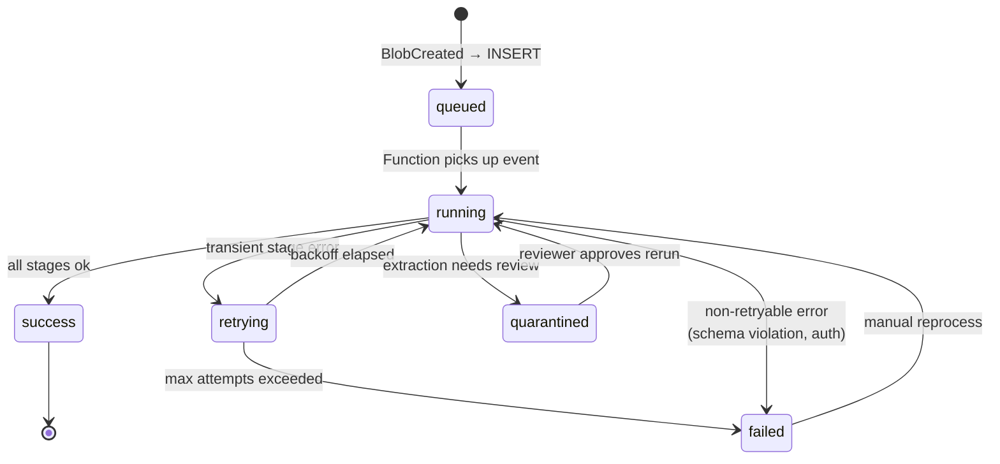
```mermaid
stateDiagram-v2
  [*] --> queued: BlobCreated → INSERT
  queued --> running: Function picks up event
  running --> success: all stages ok
  running --> retrying: transient stage error
  retrying --> running: backoff elapsed
  retrying --> failed: max attempts exceeded
  running --> failed: non-retryable error<br/>(schema violation, auth)
  running --> quarantined: extraction needs review
  quarantined --> running: reviewer approves rerun
  failed --> running: manual reprocess
  success --> [*]
```

### 4.3 ContractClause review state

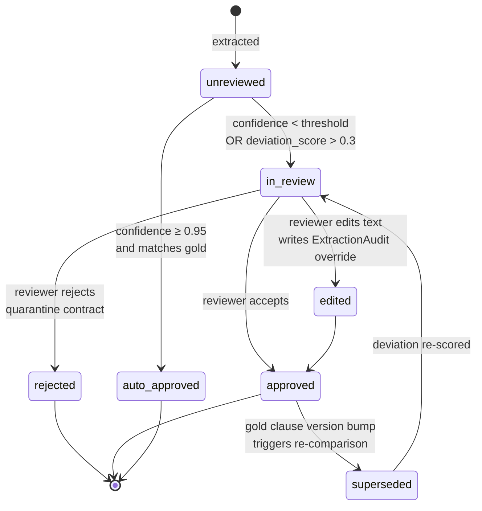
```mermaid
stateDiagram-v2
  [*] --> unreviewed: extracted
  unreviewed --> auto_approved: confidence ≥ 0.95<br/>and matches gold
  unreviewed --> in_review: confidence < threshold<br/>OR deviation_score > 0.3
  in_review --> approved: reviewer accepts
  in_review --> edited: reviewer edits text<br/>writes ExtractionAudit override
  in_review --> rejected: reviewer rejects<br/>quarantine contract
  edited --> approved
  approved --> superseded: gold clause version bump<br/>triggers re-comparison
  superseded --> in_review: deviation re-scored
  rejected --> [*]
  approved --> [*]
  auto_approved --> [*]
```

### 4.4 StandardClause (gold) lifecycle

```mermaid
stateDiagram-v2
  [*] --> draft: legal authors new version
  draft --> peer_review: submitted
  peer_review --> draft: changes requested
  peer_review --> approved: peer signs off
  approved --> effective: EffectiveFrom date passes
  effective --> superseded: new version effective
  effective --> retired: clause type discontinued
  superseded --> [*]
  retired --> [*]
  note right of approved
    All transitions emit an event;
    active contracts may be flagged
    for re-comparison on supersede
  end note
```

### 4.5 QueryAudit lifecycle

```mermaid
stateDiagram-v2
  [*] --> in_progress: query() starts
  in_progress --> success: handler returns QueryResult
  in_progress --> error: handler raises exception
  success --> persist_success: _persist_query_audit(<br/>status='success', citations, elapsed)
  error --> persist_error: _persist_query_audit(<br/>status='error', error msg, elapsed)
  persist_success --> committed: SQL commit ok
  persist_error --> committed: SQL commit ok
  persist_success --> swallowed: SQL fails →<br/>LOG.exception, no raise
  persist_error --> swallowed: SQL fails →<br/>LOG.exception, no raise
  committed --> [*]
  swallowed --> [*]
```

> Audit failures **never** break the query path. `_persist_query_audit` always wraps its own `try/except` and logs via `LOG.exception` so App Insights still captures the audit failure even when SQL is down. Caller of `query()` always gets either a `QueryResult` or the original exception re-raised.

---

## 5. UI Interaction Flows

### 5.1 Sign-in and home

```mermaid
sequenceDiagram
  autonumber
  actor U as User
  participant Browser
  participant SWA
  participant EID as Entra ID
  participant API
  U->>Browser: navigate to app
  Browser->>SWA: GET /
  SWA-->>Browser: redirect /.auth/login/aad
  Browser->>EID: OAuth2 / OIDC
  EID-->>Browser: id_token + access_token
  Browser->>SWA: GET / with cookie
  SWA-->>Browser: SPA shell
  Browser->>API: GET /api/me
  API->>API: validate JWT (SWA Easy Auth header)
  API-->>Browser: { user, tenant, features }
  Browser->>API: GET /api/contracts?status=active&top=50
  API->>SQL: SELECT TOP 50 ...
  API-->>Browser: contract list
```

### 5.2 Contract list → filter → detail

```mermaid
flowchart LR
  List[Contract list page] -->|click filter chip| Filter[Apply filter]
  Filter -->|expirationDate ≤ +90d| List
  Filter -->|contractType = supplier| List
  List -->|click row| Detail[Contract detail page]
  Detail --> Header[Metadata card<br/>+ confidence badges]
  Detail --> Tabs{Tabs}
  Tabs --> ClausesTab[Clauses tab]
  Tabs --> ChatTab[Chat / Q&A tab]
  Tabs --> ComparisonTab[Compare to gold tab]
  Tabs --> AuditTab[Audit tab]
  ClausesTab --> ClickClause[Click clause] --> ClauseModal[Clause modal:<br/>text + page jump + risk + gold link]
```

### 5.3 Chat with citations

```mermaid
sequenceDiagram
  autonumber
  actor U as User
  participant UI
  participant API
  U->>UI: ask "what does this say about audit rights?"
  UI->>API: POST /api/chat<br/>{ contractId, question, history }
  API->>API: route → search path<br/>scope filter contract_id = X
  API-->>UI: streaming tokens
  UI-->>U: render answer with [1][2] citation markers
  U->>UI: hover citation [1]
  UI->>API: GET /api/citation/{id}
  API-->>UI: { contract_id, page, quote, blob_uri }
  UI-->>U: popover with source page preview
  U->>UI: click "open at page 14"
  UI->>API: GET /api/contracts/{id}/page/14
  API-->>UI: signed blob URL + bbox highlight
```

### 5.4 Side-by-side clause comparison

```mermaid
flowchart LR
  Trigger[Click 'compare to gold'<br/>on a clause card] --> Resolve[Resolve gold version<br/>by jurisdiction + type + effective date]
  Resolve --> SideBySide["Two-pane diff view"]
  SideBySide --> LLM[gpt-4o legal-difference panel]
  SideBySide --> RiskBadge[Overall risk pill]
  SideBySide --> Action{Action menu}
  Action --> AcceptDeviation[Accept deviation<br/>→ writes ExtractionAudit + clears flag]
  Action --> Escalate[Escalate to Legal<br/>→ assigns reviewer]
  Action --> ProposeGold[Propose new gold version<br/>→ opens authoring form]
```

---

## 6. Human-in-the-Loop Modes

### 6.1 Low-confidence extraction review queue

```mermaid
flowchart TD
  Extract[Extraction completes] --> Score{"Per-field<br/>confidence ≥ threshold?"}
  Score -- yes --> Auto[Mark Contract.ReviewStatus = unreviewed<br/>field auto-approved]
  Score -- no --> Queue[Add to review queue<br/>Contract.ReviewStatus = pending_low_confidence]
  Queue --> Reviewer[Reviewer opens detail page]
  Reviewer --> Show[Side panel:<br/>extracted value + source quote +<br/>page preview + confidence]
  Show --> Decide{Decision}
  Decide --> Accept[Accept value]
  Decide --> Edit[Edit value]
  Decide --> Reject[Reject — quarantine contract]
  Accept --> Audit1[INSERT ExtractionAudit<br/>method=manual, prior_value=null]
  Edit --> Audit2[INSERT ExtractionAudit<br/>method=manual, prior_value=auto]
  Reject --> Audit3[INSERT ExtractionAudit<br/>method=manual, value=null]
  Audit1 --> Update[UPDATE Contract<br/>ReviewStatus=approved]
  Audit2 --> Update
  Audit3 --> Quar[UPDATE Contract<br/>Status=quarantined]
  Update --> Search[Republish to AI Search]
  Quar --> Triage[Ops triage]
```

### 6.2 Reviewer queue swim-lane

```mermaid
sequenceDiagram
  autonumber
  participant Sys as System
  participant Q as Review queue
  participant R as Reviewer (Legal)
  participant API
  participant SQL
  participant AIS as AI Search
  Sys->>Q: enqueue Contract X<br/>(field=ExpirationDate, conf=0.61)
  R->>API: GET /api/review/queue?role=legal
  API->>SQL: SELECT contracts WHERE ReviewStatus=pending_low_confidence
  SQL-->>API: queue items
  API-->>R: list with priority
  R->>API: GET /api/review/{contractId}/{fieldName}
  API->>SQL: extracted value + source quote + page + audit history
  API-->>R: review panel
  R->>API: POST /api/review/{contractId}/{fieldName} { decision, new_value, note }
  API->>SQL: INSERT ExtractionAudit (method=manual, reviewer=R)
  API->>SQL: UPDATE Contract field + ReviewStatus
  API->>AIS: republish affected document
  API-->>R: 200 OK + next queue item
```

### 6.3 Gold clause approval workflow

```mermaid
stateDiagram-v2
  [*] --> drafting
  drafting --> proposed: author submits
  proposed --> peer_review: assigned to peer
  peer_review --> drafting: changes requested
  peer_review --> legal_lead_review: peer approves
  legal_lead_review --> drafting: redirected
  legal_lead_review --> approved: legal lead signs off
  approved --> scheduled: EffectiveFrom set
  scheduled --> effective: EffectiveFrom date reached
  effective --> [*]: superseded by new version
  note right of approved
    Each approval writes a row in a
    StandardClauseApproval table (not in POC)
    and emits an event so downstream
    contract clauses re-score.
  end note
```

```mermaid
sequenceDiagram
  autonumber
  actor A as Author (Legal)
  actor P as Peer reviewer
  actor L as Legal lead
  participant UI
  participant API
  participant SQL

  A->>UI: open gold clause editor
  UI->>API: POST /api/standard-clauses { clauseType, jurisdiction, draftText }
  API->>SQL: INSERT StandardClause v=N+1, status=drafting
  A->>UI: submit for review
  UI->>API: PATCH /api/standard-clauses/{id} { status=proposed, reviewer=P }
  P->>UI: open review
  UI->>API: GET /api/standard-clauses/{id}
  P->>UI: approve
  UI->>API: PATCH status=legal_lead_review reviewer=L
  L->>UI: approve + set EffectiveFrom
  UI->>API: PATCH status=approved EffectiveFrom=...
  API->>SQL: UPDATE and emit GoldClauseApproved event
  Note over API,SQL: Downstream job re-scores deviation for all active contracts whose clause type matches.
```

### 6.4 Deviation override (per-contract waiver)

```mermaid
flowchart TD
  Detect[System flags clause<br/>deviation_score > 0.3<br/>RiskLevel = high] --> Card[Reviewer sees clause card]
  Card --> Review{Reviewer action}
  Review --> AcceptDev[Accept deviation for this contract]
  Review --> Reject[Reject — escalate]
  Review --> Suggest[Suggest gold update<br/>→ opens 6.3 workflow]
  AcceptDev --> Form[Justification form:<br/>reason, expiry, business owner]
  Form --> Save[INSERT into Override table<br/>contractId, clauseType, justification,<br/>approvedBy, validUntil]
  Save --> Update[UPDATE ContractClause<br/>ReviewStatus=approved<br/>RiskLevel kept for audit]
  Update --> Audit[INSERT ExtractionAudit<br/>method=manual override]
  Update --> Republish[Republish to AI Search<br/>with override flag]
  Reject --> Escalate[Move to Legal lead queue]
```

### 6.5 Reviewer roles and permissions (conceptual)

```mermaid
flowchart LR
  subgraph Roles
    Ops[Ops / Ingestion triage]
    Reviewer[Legal reviewer]
    Lead[Legal lead]
    Author[Gold-clause author]
    Read[Read-only business user]
  end

  Ops -->|reprocess failed jobs<br/>requeue index-only| RR[(IngestionJob)]
  Reviewer -->|accept / edit / reject<br/>field extractions| RC[(Contract / ContractClause)]
  Reviewer -->|file deviation override| OV[(Override table)]
  Lead -->|approve gold clauses<br/>approve high-risk overrides| GC[(StandardClause)]
  Author -->|draft + submit| GC
  Read -->|search + view| Everything[(All read-only)]
```

> Permission model lives in the application layer at POC (claims from Entra ID groups). Production wires SharePoint ACLs and per-document permission filters into AI Search.

---

## 7. Cross-cutting: Audit Trail

```mermaid
flowchart LR
  Any[Any extraction OR<br/>manual change] --> Audit[INSERT ExtractionAudit<br/>fieldName, value, source, confidence,<br/>method, model, prompt_version]
  Audit --> Blob["Append to audit/{contractId}/{ver}/{ts}.json"]
  Blob --> Replay[Reprocessing or re-eval can<br/>diff against historical audits]
  Audit --> Query[Reviewer UI shows<br/>full field history]
```

> Every mutation to an extracted field writes both a SQL `ExtractionAudit` row and an audit JSON blob — the SQL row is queryable; the blob is the immutable payload (prompt + raw model output).

### 7.1 Correlation-id flow (query path)

```mermaid
sequenceDiagram
  autonumber
  participant Client
  participant Wrap as HTTP wrapper<br/>(Functions or FastAPI)
  participant Q as shared.api.query
  participant SQL as dbo.QueryAudit
  participant AI as App Insights

  Client->>Wrap: POST /api/query
  Wrap->>Wrap: correlation_id = uuid4().hex
  Wrap->>Q: query(question, correlation_id, user_principal)
  Q->>AI: LOG.info("query_start audit_id=… correlation_id=…")<br/>OpenTelemetry sets operation_Id
  Q->>Q: dispatch to handler
  alt success
    Q->>SQL: INSERT QueryAudit (CorrelationId=…, Status='success', …)
    Q-->>Wrap: QueryResult
    Wrap-->>Client: 200 + {correlation_id, intent, answer, citations, …}
  else error
    Q->>AI: LOG.exception("query_failed correlation_id=…")
    Q->>SQL: INSERT QueryAudit (CorrelationId=…, Status='error', ErrorMessage)
    Q-->>Wrap: re-raises
    Wrap->>AI: LOG.exception again at HTTP boundary
    Wrap-->>Client: 500 + {error, correlation_id}
  end

  Note over Client,AI: Single id ties: response body ↔ QueryAudit.CorrelationId<br/>↔ App Insights operation_Id<br/>User reports "got error abc123" → full trace recoverable from any sink
```

---

## 8. Eval harness flow

```mermaid
flowchart LR
  Golden[("tests/golden_qa.jsonl<br/>25 questions × 5 paths")] --> Runner["python -m tests.eval"]
  Runner --> Loop{"for each question"}
  Loop --> Q["shared.api.query"]
  Q --> Score{"plan.intent ==<br/>expected_intent?"}
  Score -- yes --> Pass["increment correct"]
  Score -- no --> Fail["record failure"]
  Pass --> Loop
  Fail --> Loop
  Loop --> Aggregate["compute accuracy %<br/>+ per-row table"]
  Aggregate --> Report["tests/reports/{ts}.md"]
  Aggregate --> Exit{"accuracy ≥ threshold?"}
  Exit -- yes --> ZeroExit(["exit 0"])
  Exit -- no --> NonZeroExit(["exit 1"])

  GoldenContracts[("samples/contracts-synthetic/<br/>manifest.jsonl<br/>+ expected fields/clauses/risk")] --> FieldHarness["field-extraction harness<br/>tests/eval/field_extraction.py<br/>see docs/poc/19-eval-baselines.md"]
```

> Integration eval requires `RUN_INTEGRATION_EVAL=1` and a deployed (or local) stack. Unit-level rule coverage runs as part of the regular pytest suite (`tests/unit/test_golden_qa_rules.py`) — checks the deterministic shortcut, not the LLM fallback.
