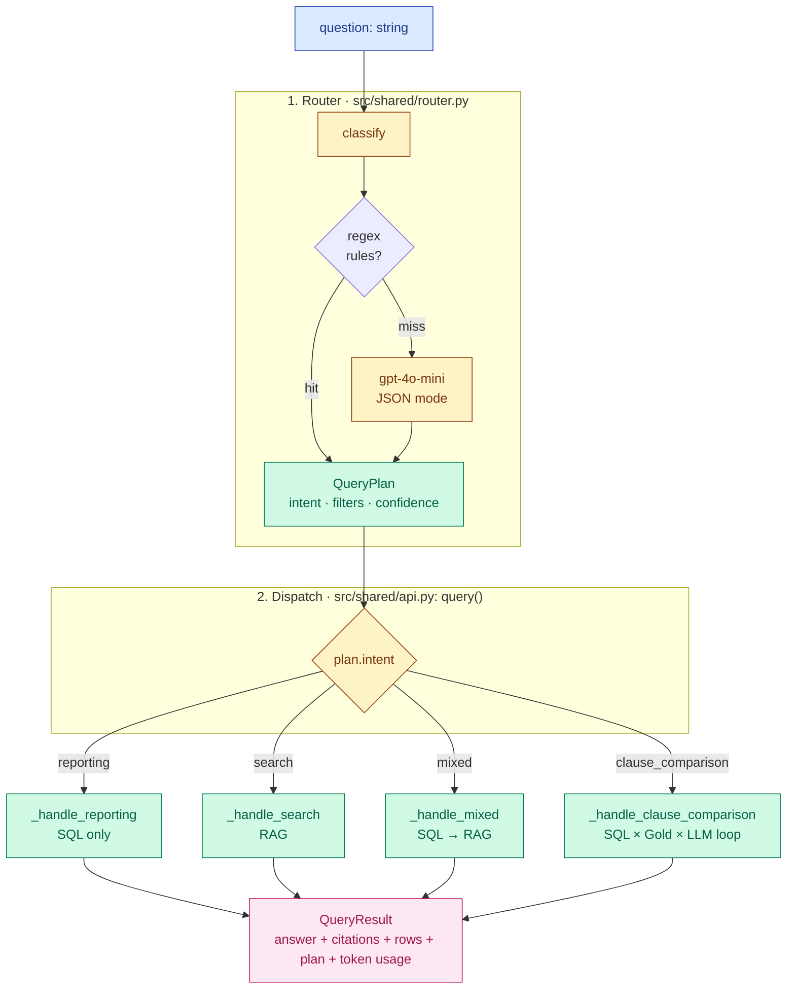

# LLM Orchestration Approach

How we route a question, fan out to data sources, and assemble an answer — without LangChain, LlamaIndex, Semantic Kernel, or any other LLM-orchestration framework.

> **Audience:** technical reviewers comparing this codebase to framework-based stacks (LangChain / LangGraph / LlamaIndex / Semantic Kernel / DSPy / AutoGen). The short version: we picked *no framework* on purpose. This document explains why, what we use instead, where that bites, and the triggers that should pull a framework forward.

---

## TL;DR

- **No agent framework**, no chains, no tool-use loop. The OpenAI Python SDK is the only "LLM library" — same SDK in both profiles, just pointed at different endpoints.
- **Router → dispatch → handler** is three plain Python functions. The router emits a typed `QueryPlan`; `query()` switches on `plan.intent`; each handler is a procedural function (~30–80 lines).
- **Determinism first.** Regex rules cover the obvious questions in <1 ms, $0; LLM is the fallback for ambiguity, not the default.
- **What we'd add a framework for** is enumerated below — none of those triggers have fired yet at POC scale.

---

## What we use (the whole LLM stack)

| Concern | Library | Pinned in |
|---|---|---|
| LLM calls (extraction, RAG answer, clause diff, router fallback) | `openai==1.54.5` | `src/local/requirements.txt`, `src/functions/*/requirements.txt` |
| Vector search | `azure-search-documents==11.6.0` (azure) / `qdrant-client==1.12.1` (local) | same |
| SQL | `pyodbc==5.2.0` | same |
| Blob | `azure-storage-blob==12.23.1` | same |
| Document parsing | `azure-ai-documentintelligence` (azure) / Unstructured-API over HTTP (local) | `src/shared/layout.py` |
| HTTP runtime | `azure-functions==1.21.3` (azure) / `fastapi==0.115.4` (local) | same |
| Token accounting | hand-rolled in `src/shared/token_ledger.py` | — |

The OpenAI SDK works identically in both profiles. In Azure mode it's `AzureOpenAI` with a managed-identity bearer-token provider; in local mode it's a plain `OpenAI` client pointed at `http://ollama:11434/v1`. Same call sites in `api.py` either way — the profile branch lives in `clients.py` factories.

**Frameworks we considered and didn't pick:** LangChain, LangGraph, LlamaIndex, Haystack, DSPy, Semantic Kernel, AutoGen, CrewAI, Instructor, Outlines, Magentic. None of their abstractions (chains, agents, tool registries, retrievers) gave us anything we couldn't write more clearly in 30 lines of Python at this scale.

---

## The three layers



### Layer 1 — Router (`src/shared/router.py`)

`classify(question) → QueryPlan` does two passes:

1. **Deterministic rules.** Regex shortcuts for the cases that don't need an LLM: "show me / list / how many" → `reporting`; "compare X to gold / standard" → `clause_comparison`; "expiring in N days" → `reporting` with `expires_within_days=N` filter; "what does <contract> say about X" → `search` scoped to one contract; "find contracts mentioning X" → `search` corpus-wide.
2. **LLM fallback.** If no rule matches, one `gpt-4o-mini` call in JSON mode returns the same `QueryPlan` shape. This is the only LLM call on the routing path, ~150–250 input tokens, ~30 output tokens, latency ~300–500 ms.

The plan is a frozen dataclass:

```python
@dataclass
class QueryPlan:
    intent: Literal["reporting","search","clause_comparison",
                    "relationship","mixed","out_of_scope"]
    data_sources: list[str]
    filters: dict[str, Any]
    confidence: float
    fallback_reason: str | None
```

`fallback_reason` is set when rules missed and the LLM had to step in — useful in `dbo.QueryAudit` for tuning the rules over time.

### Layer 2 — Dispatch (`src/shared/api.py`)

`query()` is a 40-line function: build a correlation id, call `classify()`, switch on `plan.intent`, return the handler's result wrapped in a `QueryResult`. No middleware, no plugin registry, no event bus.

### Layer 3 — Handlers

Each handler is procedural and self-contained. A reader can hold the entire control flow in their head.

| Handler | What happens | Steps | LLM calls |
|---|---|---|---|
| `_handle_reporting` | SQL-only. Builds parameterized SQL from `plan.filters` via `sql_builder.build_reporting_sql`, returns rows. | 1 SQL | 0 |
| `_handle_search` | Embed question → hit `contracts-index` → if scoped to one contract, also pull from `clauses-index` filtered by `contractId` → RAG prompt with retrieved chunks → answer. | 1 embed + 1–2 vector + 1 LLM | 1 embed + 1 chat |
| `_handle_mixed` | SQL pre-filter (e.g. "expiring supplier contracts") → pass `contractId in (…)` as a vector-search filter → RAG. Falls back to plain search if SQL returns nothing. | 1 SQL + 1 embed + 1 vector + 1 LLM | 1 embed + 1 chat |
| `_handle_clause_comparison` | Resolve contract by name → for each requested clause type: fetch contract clause text, fetch gold standard, call LLM diff. Token usage tracked per call via `token_ledger`. | 1+ SQL × N clause types, 1 LLM per available pair | N chat |

`compare_contract_to_gold(contract_id, clause_types)` (`api.py:908`) is the most complex of these and the most "agent-shaped" — but it's still a `for ct in clause_types:` loop with no orchestrator state.

---

## Why this works for the POC

- **Four bounded intents.** The whole product surface is reporting + search + comparison + mixed. There's no open-ended "the agent figures out what to do" — the router commits to one intent and the handler runs to completion.
- **Determinism is cheap and visible.** ~70% of golden-QA questions hit a regex rule. They take <1 ms, cost $0, and never surprise legal review.
- **Failure modes are local.** Each handler reads top-to-bottom. If clause comparison breaks, you read 80 lines of one function. If a chain breaks inside LangChain, you debug across the framework's abstractions.
- **Observability is trivial.** One `log.info` per stage, plus `token_ledger` accumulating per request. Correlation id flows through to `dbo.QueryAudit` and App Insights `operation_Id`. No framework-specific tracer to wire up.
- **Profile portability.** The same handler code runs against Azure OpenAI + AI Search + Azure SQL in the cloud, and Ollama + Qdrant + MSSQL-in-docker locally — because the only abstraction we built is `clients.py` factories, not a framework.

---

## When the design starts to bite — adoption triggers

Each row is a real signal, not a hypothetical. If/when you see one in production telemetry, that's the moment to introduce the corresponding framework piece — *not before*.

| Signal | What it means | What to adopt | Where |
|---|---|---|---|
| A new intent that branches on prior LLM output (e.g. "if the diff shows ambiguity, ask user a clarifying question") | We've hit a multi-turn agentic flow — the linear handler shape no longer fits | **LangGraph** (or a hand-rolled state machine first) for that *one* handler only | Replace the affected handler in `src/shared/api.py`; router stays the same |
| Clause comparison loop hits >5 clause types per request and latency is the complaint | Sequential `for` loop is the bottleneck | `asyncio.gather` over the per-clause LLM calls — no framework needed | `api.py:compare_contract_to_gold` |
| The router's JSON-mode fallback hallucinates filters and we keep adding regex patches | Symbolic routing is bottoming out | **DSPy** for the router specifically (compile a routed classifier from examples in `tests/golden_qa.jsonl`) | Replace `router.py:classify` only |
| A new use case needs the LLM to call structured tools (e.g. "look up FX rate", "fetch SharePoint version history") | True tool-use territory | OpenAI **native tool-calling** (already in the SDK) — wire tools as Python callables, no framework | New file `src/shared/tools.py`; handler dispatches |
| Need to share retrieval logic across many query types and indexes (>5) | Retrieval has become its own subsystem | **LlamaIndex** retrievers as a thin layer behind `clients.vector_search()` | `src/shared/vector_search.py` |
| Cost / latency tracing across 4+ stages becomes hard to reason about | Hand-rolled `token_ledger` no longer enough | **OpenTelemetry GenAI** semantic conventions; App Insights already supports them | `src/shared/token_ledger.py`, `clients.py` |
| A second team needs to extend handlers without touching the core | Plugin boundary needed | A small protocol/ABC for handlers — still no framework | Define `Handler` protocol in `api.py`; registry dict |
| End users want to design new intents themselves | Low-code surface | **Copilot Studio** in front of `/api/query` — already considered in ADR 0006 | No code change |

**Order of adoption if multiple signals fire:** OpenAI tool-calling → asyncio fan-out → DSPy for the router → LangGraph for one specific handler → eventually LlamaIndex retrievers. We expect to never need a single monolithic framework — the handler boundary is exactly the right place to introduce framework-bearing code piecewise.

---

## Where to make changes

A practical map for the most common modifications.

| To change… | Edit | Test |
|---|---|---|
| Add a new regex rule for a phrasing that should bypass the LLM router | `src/shared/router.py` (look for `_RULES = [...]`) | `tests/unit/test_router.py` + add row to `tests/golden_qa.jsonl` |
| Change the LLM fallback prompt for routing | `src/shared/router.py:_FALLBACK_PROMPT` (and `prompts.py` if shared) | `tests/unit/test_router.py::test_llm_fallback_*` |
| Add a new intent | (1) extend `Literal[...]` in `QueryPlan`, (2) add detection in `router.py`, (3) add handler in `api.py`, (4) add dispatch arm in `query()` | new test in `tests/unit/test_router.py`, new handler test, golden-QA row |
| Tune SQL pre-filter behavior on `mixed` | `src/shared/api.py:_handle_mixed` and `src/shared/sql_builder.py` | `tests/unit/test_sql_builder.py` |
| Change clause comparison loop semantics (parallelize, change diff prompt, add severity scoring) | `src/shared/api.py:compare_contract_to_gold` and `src/shared/prompts.py` | run golden-QA comparison rows; integration eval |
| Swap the embedding model | `src/shared/clients.py` (factory) + `infra/local/.env` (`EMBEDDING_DIM`) + Bicep contract | `tests/unit/test_bicep_app_contract.py`; recreate vector store |
| Swap the chat model | `src/shared/config.py` (`OPENAI_DEPLOYMENT_REASONING`) + Bicep `workload.bicep` | contract test |
| Add a tool the LLM can call | New `src/shared/tools.py`; pass `tools=[...]` and `tool_choice="auto"` to the chat call in the relevant handler; loop on `tool_calls` until done | new test for tool dispatcher |
| Add tracing across stages | `src/shared/token_ledger.py` (extend ledger) and instrument call sites | `tests/unit/test_token_ledger.py` |

The principle: **changes stay local to one layer**. Routing change → only `router.py`. New intent → adds a row to each layer but doesn't perturb existing rows. Vector-store swap → only `clients.py` + Bicep contract; handlers don't change.

---

## Comparison to a framework-based equivalent

If we'd built this on LangChain (illustrative — not a recommendation):

| What we have today | LangChain equivalent |
|---|---|
| `router.py:classify` (regex + LLM JSON mode) | `RouterChain` / `MultiPromptChain` |
| `api.py:query` switch + four handlers | `RouterChain` + four `LLMChain` / `RetrievalQAChain` |
| `clients.vector_search(name)` factory | `VectorStoreRetriever` per backend |
| `prompts.py` | `PromptTemplate` + partial-bind |
| `token_ledger.py` | `LangChainTracer` + callbacks |
| `tests/unit/*` (137 tests, no SDK installs) | Tests usually require LangChain installed; mocking inside chains is awkward |
| One typed dataclass `QueryPlan` flows through all layers | `BaseMessage` / `RunnableConfig` blobs flow through; types are looser |

The framework version is ~30% less code at the call sites but adds a dependency that breaks API every minor version, hides control flow behind class hierarchies, and forces test infrastructure to load the framework. At our scale, the trade is bad.

---

## Cross-references

- **Router specifics:** [`08-router-design.md`](08-router-design.md) — the five paths, regex examples, LLM fallback prompt
- **Model selection per stage:** [`03-models-and-prompts.md`](03-models-and-prompts.md) — which model runs where, why
- **Two-index design (used by search/mixed):** [`02-data-model.md`](02-data-model.md#why-two-indexes-not-one-not-n)
- **Architectural tradeoffs index:** [`05-tradeoffs.md`](05-tradeoffs.md)
- **Why no Copilot Studio at the front:** [`06-low-code-alternatives.md`](06-low-code-alternatives.md), ADR 0006
- **Profile branching mechanics:** [`12-local-runtime.md`](12-local-runtime.md)

---

## Open design questions

1. **Routing accuracy budget.** Today the rules + LLM fallback land the right intent on 23/25 golden questions. Whether 92% is sufficient before considering a DSPy-compiled router is a per-deployment call.
2. **Compare workflow shape.** Today users pick clause types explicitly via `/compare`. A natural extension is "show me everywhere this contract deviates from gold" — a different orchestration shape (LLM picks the clause types). Could land in the POC or as a fast-follow.
3. **Tool-calling appetite.** Several useful capabilities (FX lookup, currency conversion in reporting, SharePoint version pull) fit OpenAI's native tool-calling cleanly. A small spike would demonstrate the pattern; otherwise it can wait for production.
4. **Multi-turn conversational state.** Today every question is independent (no chat history is sent). A single rolling-summary turn buffer is small; full turn-by-turn memory is larger. Either is supportable; the choice depends on the use case.
