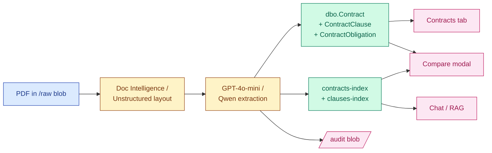

# Corpus and Gold Clauses Reference

What's actually in the POC's synthetic data, what gold clauses we compare against, and how the whole thing fits together at runtime. One place to point a reviewer or new contributor.

This is a *snapshot* — the source of truth lives in [`samples/contracts-synthetic/manifest.jsonl`](../../samples/contracts-synthetic/manifest.jsonl), [`samples/gold-clauses/`](../../samples/gold-clauses/), and the `_CLAUSE_APPLICABILITY` map in [`src/shared/api.py`](../../src/shared/api.py). When those drift this doc has to follow.

---

## The 16 synthetic contracts

Five buckets, picked to exercise different parts of the pipeline. Counterparties and contract terms are entirely fictional.

### Clean baseline (3 — should compare cleanly to gold)

| ID | Counterparty | Title | Type | Demo role |
|---|---|---|---|---|
| `syn-clean-001` | Northwind Systems Inc. | Master Services Agreement | supplier | Reference MSA — every gold clause matches. The "everything green" demo. |
| `syn-clean-002` | Beta Software Co. | Software-as-a-Service License Agreement | license | Only `license` contract — exercises the license enum value |
| `syn-clean-003` | Gamma Industries LLC | Consulting Master Services Agreement | supplier | Has explicit `auto_renewal=true`; tests the auto-renewal field extraction |

### Single-clause deviations (7 — one risky clause each)

| ID | Counterparty | Risky clause | Risk |
|---|---|---|---|
| `syn-dev-001` | Vortex Manufacturing Inc. | indemnity (one-sided) | high |
| `syn-dev-002` | Apex Cloud Services LLC | limitation_of_liability (uncapped) | high |
| `syn-dev-003` | Stellar Logistics Corp. | termination (7-day cure window) | high |
| `syn-dev-004` | Quantum Analytics Inc. | confidentiality (2-year survival, sub-gold) | high |
| `syn-dev-005` | Pacific Trade Group Pte. Ltd. | governing_law (Singapore) | high |
| `syn-dev-006` | Helix Subscription Services LLC | auto_renewal (evergreen) — and ExpirationDate=null | high |
| `syn-dev-007` | Sentinel Security Co. | audit_rights (no security-incident exception) | high |

### Missing-field cases (2 — null-handling tests)

| ID | Counterparty | What's missing | Risk |
|---|---|---|---|
| `syn-missing-001` | Crescent Partners LLC | GoverningLaw (column null + clause absent) | high |
| `syn-missing-002` | Evergreen Holdings Inc. | ExpirationDate (open-ended term) | medium |

### NDAs (2 — exercise the `nda` contract_type and "not applicable" UI affordance)

| ID | Counterparty | Form | Gov law | Demo role |
|---|---|---|---|---|
| `syn-nda-001` | Polaris Research Inc. | Mutual NDA | Massachusetts | Mutual; 3-year term, 5-year survival; demonstrates NDA-shaped clause set |
| `syn-nda-002` | Beacon Pharma Ltd. | One-way (Acme as Recipient) | New York | Asymmetric obligations; pharma-grade 7-year survival |

### Sub-document and consulting (2)

| ID | Counterparty | Form | Notes |
|---|---|---|---|
| `syn-sow-001` | Northwind Systems Inc. | Statement of Work under MSA | $185K cloud-migration project; clauses inherit from parent MSA via Section 9 |
| `syn-cons-001` | Aurora Advisory LLC | Independent Consulting | $54K/yr advisory engagement; 1099, work-for-hire IP, 12-month non-solicit |

---

## The 9 gold clauses

Each is a manually authored "approved standard" that contracts get compared against. Live in [`samples/gold-clauses/`](../../samples/gold-clauses/) (markdown) and seeded into `dbo.StandardClause` via [`scripts/sql/002-seed-gold-clauses.sql`](../../scripts/sql/002-seed-gold-clauses.sql).

| Gold clause | Standard ID | Risk policy summary |
|---|---|---|
| indemnity | `gc-indemnity-us-v1` | Mutual; IP carve-outs mandatory; deviations require Legal sign-off |
| limitation_of_liability | `gc-lol-us-v1` | Mutual cap; 12-month look-back; $100K floor; 4 mandatory exclusions |
| termination | `gc-termination-us-v1` | 30-day notice; cure window; survival list; 90-day data-export window |
| confidentiality | `gc-confidentiality-us-v1` | 5-year survival; trade-secret perpetual; compelled-disclosure carve-out |
| governing_law | `gc-governing-law-us-ny-v1` | NY default; equitable-relief carve-out non-negotiable |
| auto_renewal | `gc-auto-renewal-us-v1` | Default = no auto-renewal; 60-day notice if permitted; price cap mandatory |
| audit_rights | `gc-audit-rights-us-v1` | 1×/12mo; 30-day notice; SOC 2/ISO substitution; security-incident exception |
| **non_solicitation** | `gc-non-solicitation-us-v1` | 12-month restricted period; "material contact" qualifier mandatory; general-advertising and 6-month-cooled-off carve-outs non-negotiable |
| **return_of_information** | `gc-return-of-information-us-v1` | 30-day return/destroy window; written certification mandatory; legal-archive + automated-backup retention carve-outs non-negotiable |

The first 7 cover supplier/license-shaped contracts. The last 2 were added when the corpus grew to include NDAs and consulting agreements.

---

## How the contract types map to applicable clauses

A clause-type ↔ contract-type compatibility map lives in [`src/shared/api.py`](../../src/shared/api.py) as `_CLAUSE_APPLICABILITY`. The compare endpoints use it to decide whether a missing clause should be flagged as **expected-but-absent** (red) or **not typical for this contract type** (neutral / grey).

| | indemnity | LoL | termination | confidentiality | gov_law | auto_renewal | audit_rights | non_solicitation | return_of_info |
|---|---|---|---|---|---|---|---|---|---|
| **supplier** | ✓ | ✓ | ✓ | ✓ | ✓ | ✓ | ✓ | — | — |
| **license** | ✓ | ✓ | ✓ | ✓ | ✓ | ✓ | ✓ | — | — |
| **consulting** | ✓ | ✓ | ✓ | ✓ | ✓ | — | — | ✓ | — |
| **nda** | — | — | ✓ | ✓ | ✓ | — | — | ✓ | ✓ |
| **employment** | — | — | ✓ | ✓ | ✓ | — | — | ✓ | — |
| **lease** | ✓ | ✓ | ✓ | — | ✓ | — | — | — | — |
| **other** | (treats all as applicable — never hides a comparison) |

Legend: **✓** = clause type is part of the standard compare set for this contract type; **—** = compare endpoints return `applicable: false` and the UI greys the entry.

---

## How a comparison plays out at runtime

Two paths into clause comparison; both honor the applicability map.

**Explicit `/api/compare`** — POST `{contract_id, clause_types: [...]}` from the Contracts tab "Compare to gold" button. Each requested clause type gets one entry in the response, with three possible shapes:

```jsonc
// Case 1 — applicable + present
{
  "clause_type": "indemnity",
  "applicable": true,
  "available": true,
  "diff": "...",                    // LLM Markdown diff vs gold
  "contract_clause_text": "...",    // page-tagged contract clause
  "contract_page": 3,
  "gold_clause_id": "gc-indemnity-us-v1",
  "gold_version": 1,
  "gold_text": "..."
}

// Case 2 — applicable but missing  (red badge in UI)
{
  "clause_type": "indemnity",
  "applicable": true,
  "available": false,
  "reason": "missing contract clause"
}

// Case 3 — not applicable for this contract type  (grey/neutral badge)
{
  "clause_type": "indemnity",
  "applicable": false,
  "available": false,
  "reason": "not typical for nda contracts"
}
```

**Natural-language clause comparison** — "compare indemnity in the Polaris MSA to gold" routed to `_handle_clause_comparison`. Same applicability rules: if the resolved contract is an NDA and the user asked about indemnity, the answer renders as `_Not typical for nda contracts._` rather than running a hollow diff or flagging a missing-but-expected clause.

---

## How a contract gets into the system (one-line each)



Per-stage detail in [`11-ingestion-pipeline.md`](11-ingestion-pipeline.md). Query path detail in [`18-llm-orchestration.md`](18-llm-orchestration.md).

---

## Demo flows that exercise the full surface

| Flow | Steps | Demonstrates |
|---|---|---|
| **All-green compare** | Open Contracts → Northwind MSA → "Compare to gold" → check all 7 supplier clauses | The clean baseline; LLM diff returns "matches gold" per clause |
| **Single-clause deviation** | Open Vortex Manufacturing → compare indemnity → see flagged differences | The 1-of-7 red pattern; LLM identifies the one-sidedness |
| **Missing field** | Reporting query "How many contracts are missing governing law?" → 1 row (Crescent Partners) | Null-handling end-to-end; router → SQL filter → result |
| **NDA-shaped compare** | Open Polaris Research → compare against all 9 gold clauses | "Not applicable" affordance — 4 clauses grey, 5 compared |
| **Consulting-specific compare** | Open Aurora Advisory → compare non_solicitation | One of the new-gold-clause additions; cleanly compared |
| **Reporting + filter** | "Show me supplier contracts" → 11 rows | Router regex shortcut, no LLM call |
| **Mixed query** | "Which expiring supplier contracts have non-standard indemnity?" | Router classifies as `mixed` → SQL pre-filter → vector search |
| **Search across the corpus** | "Find contracts mentioning SOC 2" → top contracts surface | Two-index design (`contracts-index` + `clauses-index`) |

---

## What this corpus does *not* cover

Honest scope statement so reviewers know where the test surface ends:

- **No employment contracts** — the `employment` enum value is supported by the prompt and compatibility map but no synthetic example exists yet
- **No lease contracts** — same situation as employment
- **No multi-year version history** — every contract is at FileVersion 1; the schema supports versioning but the corpus doesn't exercise it
- **No amendments / parent-child references** — the SOW references a parent MSA in narrative text but `dbo.Contract` has no `parent_contract_id` column (deferred per [ADR 0007](../adr/0007-defer-graph-database.md))
- **No genuinely large contracts** — every PDF is 2–4 pages. CUAD documents (~25k pages, real commercial contracts) are documented in [`07-sample-documents.md`](07-sample-documents.md) but not redistributed
- **No real counterparty data** — every name is fictional ([README](../../README.md#synthetic-data))

When any of those limitations becomes load-bearing for evaluation, the next step is documented at the link.
